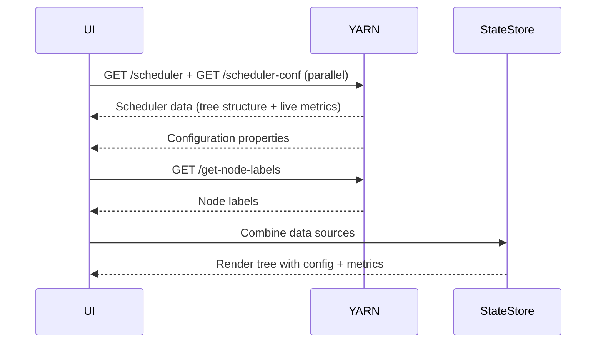
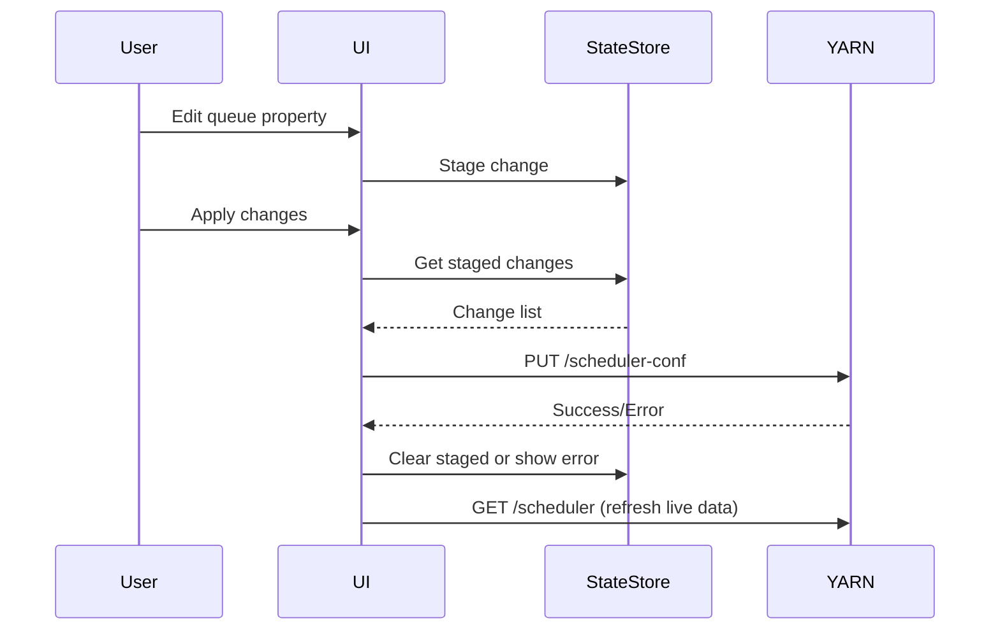

# Apache Hadoop YARN Capacity Scheduler UI Design Document

## Table of Contents
1. [Executive Summary](#executive-summary)
2. [YARN API Overview](#yarn-api-overview)
3. [Understanding YARN Properties](#understanding-yarn-properties)
4. [Capacity Scheduler Configuration Reference](#capacity-scheduler-configuration-reference)
5. [Data Flow Architecture](#data-flow-architecture)
6. [State Management Design](#state-management-design)
7. [API Integration Strategy](#api-integration-strategy)
8. [Change Management Workflow](#change-management-workflow)
9. [Node Labels Implementation](#node-labels-implementation)
10. [Error Handling Strategy](#error-handling-strategy)
11. [Technology Stack Recommendations](#technology-stack-recommendations)
12. [Implementation Roadmap](#implementation-roadmap)
13. [What's Next - Future Enhancements](#whats-next---future-enhancements)

## Executive Summary

This document provides a comprehensive design guide for building a web-based UI for managing Apache Hadoop YARN Capacity Scheduler configurations. The UI will leverage YARN's REST APIs to provide an intuitive interface for viewing, editing, and managing queue hierarchies, resource allocations, and node labels.

### Key Features
- Real-time queue tree visualization with live metrics
- Staged configuration changes with preview
- Node label management and visualization
- Metadata-driven property editor
- Atomic configuration updates via Mutation API

### Core Workflow
1. **Load**: Fetch configuration from `/scheduler-conf` and enrich with live metrics from `/scheduler`
2. **Edit**: User modifies queues through metadata-driven property editors
3. **Stage**: Changes are staged locally with validation
4. **Preview**: User reviews all staged changes
5. **Apply**: Changes are sent to YARN via mutation API
6. **Refresh**: UI updates with new configuration

## YARN API Overview

### Primary Endpoints

#### 1. Configuration Management
```
GET  /ws/v1/cluster/scheduler-conf          # Retrieve current configuration
PUT  /ws/v1/cluster/scheduler-conf          # Update configuration
POST /ws/v1/cluster/scheduler-conf/validate # Validate changes without applying
GET  /ws/v1/cluster/scheduler-conf/version  # Get configuration version
```

#### 2. Live Metrics
```
GET /ws/v1/cluster/scheduler                # Get live scheduler state and metrics
```

#### 3. Node Labels
```
POST /ws/v1/cluster/add-node-labels         # Add new labels
POST /ws/v1/cluster/remove-node-labels      # Remove labels
POST /ws/v1/cluster/replace-node-to-labels  # Assign labels to nodes
GET  /ws/v1/cluster/get-node-labels         # List all labels
GET  /ws/v1/cluster/get-node-to-labels      # Get node-to-label mappings
```

### API Authentication
- Requires admin privileges (`yarn.admin.acl`)
- Supports Kerberos and simple authentication
- All mutation operations require authentication

### Response Formats
- Supports both XML and JSON (via Accept/Content-Type headers)
- Error responses include detailed exception information
- All operations return appropriate HTTP status codes

## Understanding YARN Properties

### Property Structure

YARN properties follow a hierarchical dot-notation format:
```
yarn.scheduler.capacity.<queue-path>.<property-name>
```

**Note**: With the dual-loading approach, the UI doesn't need to parse these properties. Instead:
- Queue paths come pre-parsed from the `/scheduler` endpoint
- The UI constructs property keys when needed: `yarn.scheduler.capacity.${queuePath}.${property}`
- This eliminates the complexity of parsing multi-part properties like `accessible-node-labels.<label>.capacity`

### Queue Configuration

1. **Parent Queue Declaration**
   ```
   yarn.scheduler.capacity.root.queues = production,development
   ```
   The `queues` property is the **only** way to define parent-child relationships.

2. **Queue Name Restrictions**
    - **Queue names cannot contain dots (.)** - YARN uses dots as path separators
    - No escaping mechanism exists
    - Names should use alphanumeric characters, hyphens, or underscores

### Queue Name Validation
```typescript
function validateQueueName(name: string): ValidationResult {
  if (!name || name.trim() === '') {
    return { valid: false, message: 'Queue name cannot be empty' };
  }
  
  if (name.includes('.')) {
    return { valid: false, message: 'Queue names cannot contain dots (.)' };
  }
  
  if (!/^[a-zA-Z0-9_-]+$/.test(name)) {
    return { valid: false, message: 'Queue names should only contain letters, numbers, hyphens, and underscores' };
  }
  
  return { valid: true };
}
```

### Node Label Properties
Node label properties include an additional dimension:
```
yarn.scheduler.capacity.root.production.accessible-node-labels.GPU.capacity
```
- **Queue Path**: `root.production`
- **Property Type**: `accessible-node-labels`
- **Label**: `GPU`
- **Label Property**: `capacity`

## Capacity Scheduler Configuration Reference

### Queue-Level Properties

#### Basic Configuration
| Property | Description | Default | Valid Values |
|----------|-------------|---------|--------------|
| `queues` | Comma-separated list of child queues | - | String list |
| `capacity` | Queue capacity | - | Percentage, weight (e.g., "10w"), or absolute |
| `maximum-capacity` | Maximum queue capacity | 100.0 | 0-100 or absolute |
| `state` | Queue state | RUNNING | RUNNING, STOPPED |
| `priority` | Queue priority | 0 | Integer |

#### User Limits
| Property | Description | Default | Valid Values |
|----------|-------------|---------|--------------|
| `minimum-user-limit-percent` | Minimum resource guarantee per user | 100 | 1-100 |
| `user-limit-factor` | Multiplier for user resource limit | 1.0 | Float > 0 |
| `user-settings.<username>.weight` | Per-user weight | 1.0 | Float > 0 |

#### Application Limits
| Property | Description | Default | Valid Values |
|----------|-------------|---------|--------------|
| `maximum-applications` | Max applications in queue | -1 (unlimited) | Integer |
| `maximum-am-resource-percent` | Max resources for AMs | - | 0.0-1.0 |
| `max-parallel-apps` | Max parallel applications | Integer.MAX_VALUE | Integer |

### Global Properties

#### Core Settings
| Property | Description | Default |
|----------|-------------|---------|
| `yarn.scheduler.capacity.maximum-applications` | Global max applications | 10000 |
| `yarn.scheduler.capacity.maximum-am-resource-percent` | Global max AM resources | 0.1 |
| `yarn.scheduler.capacity.resource-calculator` | Resource calculator class | DefaultResourceCalculator |

### Metadata-Driven Property Descriptor Format

```typescript
interface PropertyDescriptor {
  key: string;                    // e.g., "capacity"
  displayName: string;            // e.g., "Queue Capacity"
  description: string;            // Detailed description
  category: 'basic' | 'limits' | 'scheduling' | 'advanced';
  type: 'number' | 'string' | 'boolean' | 'select' | 'resource';
  validation?: {
    min?: number;
    max?: number;
    pattern?: string;
    required?: boolean;
    options?: Array<{value: string, label: string}>;
  };
  default?: any;
  unit?: string;                  // e.g., "%", "MB", "vcores"
  format?: 'percentage' | 'weight' | 'absolute';
  applicableTo: 'leaf' | 'parent' | 'both';
  nodeLabelsSupported: boolean;
}
```

## Data Flow Architecture

### Dual-Loading Approach

The UI uses a dual-loading strategy to combine the best of both worlds:
- **Queue tree structure** from `/scheduler` (no parsing needed!)
- **Configuration values** from `/scheduler-conf` (for editing)

### Initial Load Sequence


### Data Source Separation
```typescript
// From /scheduler - Tree structure and live data
interface SchedulerData {
  queuePath: string;          // "root.production"
  queueName: string;          // "production"
  children: QueueInfo[];      // Pre-built hierarchy!
  usedCapacity: number;       // Live usage
  numApplications: number;    // Current apps
  state: string;             // RUNNING/STOPPED
}

// From /scheduler-conf - Configuration values
interface ConfigData {
  'yarn.scheduler.capacity.root.production.capacity': '50';
  'yarn.scheduler.capacity.root.production.maximum-capacity': '100';
  // ... all other properties
}

// Combined for display
interface DisplayQueue {
  // Structure from scheduler
  ...schedulerData,
  
  // Configured values
  configured: {
    capacity: string;        // From config
    maxCapacity: string;     // From config
  },
  
  // Staged changes (if any)
  staged?: {
    capacity?: string;
    maxCapacity?: string;
  }
}
```

### Configuration Update Flow


## State Management Design

### Recommended Architecture: Zustand with Immer

```typescript
// Label configuration for a queue
interface LabelConfig {
  name: string;
  capacity?: number;
  maximumCapacity?: number;
  maximumAmResourcePercent?: number;
  isAccessible: boolean;
}

// Node label definition
interface NodeLabel {
  name: string;
  exclusivity: boolean;
  partitionName?: string;
  activeNMs?: number;
  totalResource?: ResourceInfo;
}

// Resource information
interface ResourceInfo {
  memory: number;
  vCores: number;
  resourceInformations?: Record<string, number>;
}

interface QueueNode {
  path: string;
  name: string;
  type: 'leaf' | 'parent';
  properties: Map<string, string>;
  children: QueueNode[];
  metrics?: QueueMetrics;
  labelConfigs: Map<string, LabelConfig>;  // Label name -> config
}

interface QueueMetrics {
  usedCapacity: number;
  absoluteUsedCapacity: number;
  numApplications: number;
  numActiveApplications: number;
  numPendingApplications: number;
  resourcesUsed: ResourceInfo;
}

interface StagedChange {
  id: string;
  type: 'add' | 'update' | 'remove';
  queuePath: string;
  property?: string;
  oldValue?: string;
  newValue?: string;
}

interface SchedulerStore {
  // Dual data sources
  schedulerData: SchedulerInfo | null;      // From /scheduler - tree structure
  configData: Map<string, string>;          // From /scheduler-conf - properties
  
  // Other state
  nodeLabels: NodeLabel[];
  stagedChanges: StagedChange[];
  selectedNodeLabel: string | null;
  configVersion: number;
  
  // Actions
  loadInitialData: () => Promise<void>;
  refreshSchedulerData: () => Promise<void>;
  stageQueueChange: (queuePath: string, property: string, value: string) => void;
  stageQueueAddition: (parentPath: string, queueName: string, config: Record<string, string>) => void;
  stageQueueRemoval: (queuePath: string) => void;
  stageLabelQueueChange: (queuePath: string, label: string, property: string, value: string) => void;
  getLabelChangesForQueue: (queuePath: string, label: string) => StagedChange[];
  applyChanges: () => Promise<void>;
  revertChange: (changeId: string) => void;
  clearAllChanges: () => void;
  selectNodeLabel: (label: string | null) => void;
  
  // Computed values
  getQueueConfiguredCapacity: (queuePath: string) => string;
  getQueueDisplayValue: (queuePath: string, property: string) => { value: string; isStaged: boolean };
}

// Zustand store implementation
const useSchedulerStore = create<SchedulerStore>()(
  immer((set, get) => ({
    schedulerData: null,
    configData: new Map(),
    nodeLabels: [],
    stagedChanges: [],
    selectedNodeLabel: null,
    configVersion: 0,
    
    loadInitialData: async () => {
      // Load both endpoints in parallel
      const [schedulerResponse, configResponse, labelsResponse] = await Promise.all([
        fetch('/ws/v1/cluster/scheduler'),
        fetch('/ws/v1/cluster/scheduler-conf'),
        fetch('/ws/v1/cluster/get-node-labels')
      ]);
      
      const scheduler = await schedulerResponse.json();
      const config = await configResponse.json();
      const labels = await labelsResponse.json();
      
      set(state => {
        // Use scheduler data directly - no parsing needed!
        state.schedulerData = scheduler;
        
        // Convert config to map for easy lookup
        state.configData = new Map(
          config.properties.map((p: any) => [p.name, p.value])
        );
        
        state.nodeLabels = labels.nodeLabels;
      });
    },
    
    refreshSchedulerData: async () => {
      // Refresh only the scheduler data (live metrics)
      const response = await fetch('/ws/v1/cluster/scheduler');
      const scheduler = await response.json();
      
      set(state => {
        state.schedulerData = scheduler;
      });
    },
    
    stageQueueChange: (queuePath, property, value) => {
      set(state => {
        const propertyKey = `yarn.scheduler.capacity.${queuePath}.${property}`;
        const change: StagedChange = {
          id: generateId(),
          type: 'update',
          queuePath,
          property,
          oldValue: state.configData.get(propertyKey),
          newValue: value
        };
        state.stagedChanges.push(change);
      });
    },
    
    applyChanges: async () => {
      const changes = get().stagedChanges;
      const request = buildMutationRequest(changes);
      
      const response = await fetch('/ws/v1/cluster/scheduler-conf', {
        method: 'PUT',
        headers: { 'Content-Type': 'application/json' },
        body: JSON.stringify(request)
      });
      
      if (response.ok) {
        set(state => {
          state.stagedChanges = [];
          state.configVersion += 1;
        });
        // Reload both data sources
        await get().loadInitialData();
      } else {
        throw new Error(await response.text());
      }
    },
    
    // Computed value helpers
    getQueueConfiguredCapacity: (queuePath: string) => {
      const state = get();
      const propertyKey = `yarn.scheduler.capacity.${queuePath}.capacity`;
      
      // Check staged changes first
      const stagedChange = state.stagedChanges.find(
        c => c.queuePath === queuePath && c.property === 'capacity'
      );
      
      if (stagedChange) {
        return stagedChange.newValue || '0';
      }
      
      // Return configured value
      return state.configData.get(propertyKey) || '0';
    },
    
    getQueueDisplayValue: (queuePath: string, property: string) => {
      const state = get();
      const propertyKey = `yarn.scheduler.capacity.${queuePath}.${property}`;
      
      // Check staged changes first
      const stagedChange = state.stagedChanges.find(
        c => c.queuePath === queuePath && c.property === property
      );
      
      if (stagedChange) {
        return { value: stagedChange.newValue || '', isStaged: true };
      }
      
      // Return configured value
      return { 
        value: state.configData.get(propertyKey) || '', 
        isStaged: false 
      };
    }
  }))
);
```

### Using Scheduler Data for Queue Tree

With the dual-loading approach, we don't need to parse the queue tree - YARN has already done this for us!

```typescript
// The scheduler response already contains the full tree structure
interface SchedulerInfo {
  type: "capacityScheduler";
  capacity: number;
  usedCapacity: number;
  maxCapacity: number;
  queueName: string;
  queues: {
    queue: QueueInfo[];  // Child queues - already structured!
  };
}

interface QueueInfo {
  type: string;  // "capacitySchedulerLeafQueueInfo" or parent
  capacity: number;
  usedCapacity: number;
  maxCapacity: number;
  absoluteCapacity: number;
  absoluteMaxCapacity: number;
  absoluteUsedCapacity: number;
  numApplications: number;
  queueName: string;
  queuePath: string;      // Full path like "root.production"
  state: "RUNNING" | "STOPPED";
  queues?: {
    queue: QueueInfo[];   // Nested children
  };
  // ... many other live metrics
}

// Simple tree traversal - no parsing needed!
function traverseQueueTree(
  queueInfo: QueueInfo, 
  configData: Map<string, string>,
  visitor: (queue: DisplayQueue) => void
) {
  // Combine scheduler structure with config values
  const displayQueue: DisplayQueue = {
    ...queueInfo,
    configured: {
      capacity: configData.get(`yarn.scheduler.capacity.${queueInfo.queuePath}.capacity`) || '0',
      maxCapacity: configData.get(`yarn.scheduler.capacity.${queueInfo.queuePath}.maximum-capacity`) || '100',
      userLimitFactor: configData.get(`yarn.scheduler.capacity.${queueInfo.queuePath}.user-limit-factor`) || '1',
      // ... other configured values
    }
  };
  
  visitor(displayQueue);
  
  // Recursively visit children (if any)
  if (queueInfo.queues?.queue) {
    queueInfo.queues.queue.forEach(child => 
      traverseQueueTree(child, configData, visitor)
    );
  }
}
```

## API Integration Strategy

### Direct API Calls

YARN's REST APIs are straightforward and don't require a complex service layer. Direct fetch calls with proper error handling are sufficient:

```typescript
// Simple API helper functions
const API_BASE = '/ws/v1/cluster';

async function fetchConfiguration(): Promise<Map<string, string>> {
  const response = await fetch(`${API_BASE}/scheduler-conf`, {
    headers: { 'Accept': 'application/json' }
  });
  
  if (!response.ok) {
    const error = await response.text();
    throw new Error(`Failed to load configuration: ${error}`);
  }
  
  const data = await response.json();
  return new Map(data.properties.map((p: any) => [p.name, p.value]));
}

async function updateConfiguration(request: SchedConfUpdateInfo): Promise<void> {
  const response = await fetch(`${API_BASE}/scheduler-conf`, {
    method: 'PUT',
    headers: { 'Content-Type': 'application/json' },
    body: JSON.stringify(request)
  });
  
  if (!response.ok) {
    const error = await response.json();
    throw new Error(error.RemoteException?.message || 'Update failed');
  }
}

async function validateConfiguration(request: SchedConfUpdateInfo): Promise<boolean> {
  const response = await fetch(`${API_BASE}/scheduler-conf/validate`, {
    method: 'POST',
    headers: { 'Content-Type': 'application/json' },
    body: JSON.stringify(request)
  });
  
  return response.ok;
}
```

### Building Mutation Requests

```typescript
function buildMutationRequest(changes: StagedChange[]): SchedConfUpdateInfo {
  const request: SchedConfUpdateInfo = {
    'add-queue': [],
    'update-queue': [],
    'remove-queue': [],
    'global-updates': {}
  };
  
  // Separate global updates from queue changes
  const globalChanges = changes.filter(c => c.queuePath === 'global');
  const queueChanges = changes.filter(c => c.queuePath !== 'global');
  
  // Process global updates
  // Global updates use the full property name (e.g., yarn.scheduler.capacity.maximum-applications)
  for (const change of globalChanges) {
    if (change.property && change.newValue) {
      request['global-updates'][change.property] = change.newValue;
    }
  }
  
  // Group queue changes by queue path
  const changesByQueue = new Map<string, StagedChange[]>();
  
  for (const change of queueChanges) {
    if (!changesByQueue.has(change.queuePath)) {
      changesByQueue.set(change.queuePath, []);
    }
    changesByQueue.get(change.queuePath)!.push(change);
  }
  
  // Process each queue's changes
  for (const [queuePath, changes] of changesByQueue) {
    const firstChange = changes[0];
    
    if (firstChange.type === 'add') {
      const params: Record<string, string> = {};
      for (const change of changes) {
        if (change.property && change.newValue) {
          // For new queues, use just the property name without prefix
          params[change.property] = change.newValue;
        }
      }
      request['add-queue']!.push({
        'queue-name': queuePath,
        'params': params
      });
    } else if (firstChange.type === 'update') {
      const params: Record<string, string> = {};
      for (const change of changes) {
        if (change.property && change.newValue) {
          // For queue updates, only use the property name, not the full path
          params[change.property] = change.newValue;
        }
      }
      request['update-queue']!.push({
        'queue-name': queuePath,
        'params': params
      });
    } else if (firstChange.type === 'remove') {
      request['remove-queue']!.push(queuePath);
    }
  }
  
  return request;
}
```

### Global Configuration Updates

Global scheduler properties (those that apply to the entire scheduler, not specific queues) require special handling:

```typescript
// Example: Staging a global configuration change
const stageGlobalChange = (property: string, value: string) => {
  // Global changes use 'global' as the queuePath
  const change: StagedChange = {
    id: generateId(),
    type: 'update',
    queuePath: 'global',
    property: property, // Full property name, e.g., 'yarn.scheduler.capacity.maximum-applications'
    oldValue: configData.get(property),
    newValue: value
  };
  
  stagedChanges.push(change);
};

// Example global properties:
// - yarn.scheduler.capacity.maximum-applications
// - yarn.scheduler.capacity.maximum-am-resource-percent
// - yarn.scheduler.capacity.resource-calculator
// - yarn.scheduler.capacity.user-metrics.enable
```

When the mutation request is built, global changes are separated and placed in the `global-updates` section with their full property names, while queue-specific changes use only the property name without the prefix.

## Change Management Workflow

### Staging Changes

1. **Property Edit**: User modifies a queue property
2. **Validation**: Client-side validation based on metadata
3. **Stage**: Change is added to staged changes list
4. **Preview**: User can see all staged changes with diffs

### Applying Changes

1. **Pre-validation**: Optional validation via `/scheduler-conf/validate`
2. **Build Request**: Convert staged changes to SchedConfUpdateInfo
3. **Submit**: Send PUT request to `/scheduler-conf`
4. **Handle Response**:
    - Success: Clear staged changes, reload configuration
    - Failure: Show error, maintain staged changes

### Complex Operations

#### Queue Hierarchy Restructuring
```typescript
// Example: Converting leaf queue to parent with children
const changes = [
  // First, update the queue to have children
  {
    type: 'update',
    queuePath: 'root.production',
    property: 'queues',
    newValue: 'batch,interactive'
  },
  // Add the new child queues
  {
    type: 'add',
    queuePath: 'root.production.batch',
    properties: {
      capacity: '60',
      'maximum-capacity': '100'
    }
  },
  {
    type: 'add',
    queuePath: 'root.production.interactive',
    properties: {
      capacity: '40',
      'maximum-capacity': '100'
    }
  }
];
```

### Staged Changes Visualization

#### Visual Indicators for Changed Fields

```typescript
interface StageChangeIndicator {
  fieldId: string;
  queuePath: string;
  property: string;
  originalValue: string | undefined;
  stagedValue: string;
  changeType: 'add' | 'update' | 'remove';
}

// Component for individual property field
const PropertyField: React.FC<{
  queuePath: string;
  property: string;
  value: string;
  stagedChange?: StagedChange;
}> = ({ queuePath, property, value, stagedChange }) => {
  const hasChange = !!stagedChange;
  const isNewProperty = stagedChange?.type === 'add' && !stagedChange.oldValue;
  
  return (
    <div className={`property-field ${hasChange ? 'has-staged-change' : ''}`}>
      <label>
        {property}
        {hasChange && (
          <span className="change-indicator">
            {isNewProperty ? '(new)' : '(modified)'}
          </span>
        )}
      </label>
      
      <div className="field-wrapper">
        <input
          value={stagedChange?.newValue ?? value}
          onChange={(e) => handlePropertyChange(queuePath, property, e.target.value)}
          className={hasChange ? 'staged-value' : ''}
        />
        
        {hasChange && !isNewProperty && (
          <div className="original-value">
            <span className="label">Original:</span>
            <span className="value">{stagedChange.oldValue}</span>
            <button 
              className="revert-btn"
              onClick={() => revertChange(stagedChange.id)}
              title="Revert to original value"
            >
              ↩
            </button>
          </div>
        )}
      </div>
    </div>
  );
};
```

#### Queue Tree Visual States

```typescript
// Enhanced QueueNode with staging information
interface QueueNodeWithStaging extends QueueNode {
  stagedChanges: StagedChange[];
  isNew: boolean;
  isDeleted: boolean;
  hasModifications: boolean;
}

// Queue tree node component
const QueueTreeNode: React.FC<{ queue: QueueNodeWithStaging }> = ({ queue }) => {
  const getNodeClassName = () => {
    const classes = ['queue-node'];
    
    if (queue.isNew) classes.push('queue-new');
    if (queue.isDeleted) classes.push('queue-deleted');
    if (queue.hasModifications) classes.push('queue-modified');
    
    return classes.join(' ');
  };
  
  const getChangesSummary = () => {
    const changes = queue.stagedChanges;
    if (changes.length === 0) return null;
    
    const summary = {
      properties: changes.filter(c => c.type === 'update').length,
      additions: changes.filter(c => c.type === 'add' && !c.property).length,
      deletions: changes.filter(c => c.type === 'remove').length
    };
    
    return (
      <div className="changes-summary">
        {summary.properties > 0 && (
          <span className="change-count properties">
            {summary.properties} properties modified
          </span>
        )}
        {queue.isNew && <span className="change-count new">New queue</span>}
        {queue.isDeleted && <span className="change-count deleted">To be deleted</span>}
      </div>
    );
  };
  
  return (
    <div className={getNodeClassName()}>
      <div className="queue-header">
        <span className="queue-name">{queue.name}</span>
        {queue.stagedChanges.length > 0 && (
          <span className="change-badge">{queue.stagedChanges.length}</span>
        )}
      </div>
      {getChangesSummary()}
    </div>
  );
};
```

#### Staged Changes Panel

```typescript
const StagedChangesPanel: React.FC = () => {
  const { stagedChanges, revertChange, clearAllChanges } = useSchedulerStore();
  
  const groupedChanges = useMemo(() => {
    const groups = new Map<string, StagedChange[]>();
    
    stagedChanges.forEach(change => {
      const key = change.queuePath;
      if (!groups.has(key)) {
        groups.set(key, []);
      }
      groups.get(key)!.push(change);
    });
    
    return Array.from(groups.entries()).map(([queuePath, changes]) => ({
      queuePath,
      changes: changes.sort((a, b) => a.timestamp - b.timestamp)
    }));
  }, [stagedChanges]);
  
  return (
    <div className="staged-changes-panel">
      <div className="panel-header">
        <h3>Staged Changes ({stagedChanges.length})</h3>
        <button onClick={clearAllChanges} disabled={stagedChanges.length === 0}>
          Clear All
        </button>
      </div>
      
      <div className="changes-list">
        {groupedChanges.map(({ queuePath, changes }) => (
          <div key={queuePath} className="queue-changes">
            <h4>{queuePath}</h4>
            {changes.map(change => (
              <ChangeItem key={change.id} change={change} onRevert={revertChange} />
            ))}
          </div>
        ))}
      </div>
      
      <div className="panel-footer">
        <button className="apply-changes" disabled={stagedChanges.length === 0}>
          Apply {stagedChanges.length} Changes
        </button>
      </div>
    </div>
  );
};

const ChangeItem: React.FC<{ 
  change: StagedChange; 
  onRevert: (id: string) => void;
}> = ({ change, onRevert }) => {
  const getChangeDescription = () => {
    switch (change.type) {
      case 'add':
        return change.property 
          ? `Add property: ${change.property} = ${change.newValue}`
          : `Add new queue`;
      case 'update':
        return (
          <div className="change-diff">
            <span className="property-name">{change.property}:</span>
            <span className="old-value">{change.oldValue || '(empty)'}</span>
            <span className="arrow">→</span>
            <span className="new-value">{change.newValue}</span>
          </div>
        );
      case 'remove':
        return `Remove queue`;
    }
  };
  
  return (
    <div className="change-item">
      <div className="change-content">{getChangeDescription()}</div>
      <button className="revert-btn" onClick={() => onRevert(change.id)}>
        Revert
      </button>
    </div>
  );
};
```

#### CSS Styling for Visual Indicators

```css
/* Staged change indicators */
.property-field.has-staged-change {
  background-color: #fff3cd;
  border-left: 3px solid #ffc107;
  padding-left: 12px;
}

.property-field .change-indicator {
  color: #856404;
  font-size: 0.85em;
  margin-left: 8px;
}

.field-wrapper .staged-value {
  border-color: #ffc107;
  background-color: #fffbf0;
}

.original-value {
  margin-top: 4px;
  font-size: 0.9em;
  color: #666;
  display: flex;
  align-items: center;
  gap: 8px;
}

.original-value .value {
  text-decoration: line-through;
  color: #999;
}

/* Queue tree visual states */
.queue-node.queue-new {
  border: 2px dashed #28a745;
  background-color: #d4edda;
}

.queue-node.queue-deleted {
  opacity: 0.6;
  border: 2px dashed #dc3545;
  background-color: #f8d7da;
}

.queue-node.queue-modified {
  border: 2px solid #ffc107;
  background-color: #fff3cd;
}

.queue-node .change-badge {
  background-color: #dc3545;
  color: white;
  border-radius: 10px;
  padding: 2px 6px;
  font-size: 0.8em;
  margin-left: 8px;
}

/* Staged changes panel */
.staged-changes-panel {
  position: fixed;
  right: 0;
  top: 60px;
  width: 350px;
  height: calc(100vh - 60px);
  background: white;
  box-shadow: -2px 0 8px rgba(0,0,0,0.1);
  display: flex;
  flex-direction: column;
}

.change-diff {
  display: flex;
  align-items: center;
  gap: 8px;
}

.change-diff .old-value {
  color: #dc3545;
  text-decoration: line-through;
}

.change-diff .arrow {
  color: #666;
}

.change-diff .new-value {
  color: #28a745;
  font-weight: 500;
}
```

### Queue Card Components with Dual-Loading

With the dual-loading approach, queue cards display configured values while showing live metrics separately:

```typescript
interface QueueCardProps {
  queueInfo: QueueInfo;         // From /scheduler - live data
  queuePath: string;            // Queue path for lookups
}

const QueueCard: React.FC<QueueCardProps> = ({ queueInfo, queuePath }) => {
  const store = useSchedulerStore();
  
  // Get configured values (with staged changes)
  const capacity = store.getQueueDisplayValue(queuePath, 'capacity');
  const maxCapacity = store.getQueueDisplayValue(queuePath, 'maximum-capacity');
  const autoQueueCreation = store.getQueueDisplayValue(queuePath, 'auto-create-child-queue.enabled');
  
  // Live data from scheduler
  const liveMetrics = {
    usedCapacity: queueInfo.usedCapacity,
    absoluteUsedCapacity: queueInfo.absoluteUsedCapacity,
    numApplications: queueInfo.numApplications,
    state: queueInfo.state,
    resourcesUsed: queueInfo.resourcesUsed
  };
  
  // Detect configuration drift
  const hasDrift = Math.abs(parseFloat(capacity.value) - queueInfo.capacity) > 0.01;
  
  return (
    <Card className={`queue-card ${capacity.isStaged ? 'has-staged-changes' : ''}`}>
      <CardHeader>
        <h3>{queueInfo.queueName}</h3>
        <QueueStateBadge state={queueInfo.state} />
      </CardHeader>
      
      <CardBody>
        {/* Configured values section */}
        <div className="configured-section">
          <h4>Configuration</h4>
          <div className="capacity-display">
            <label>Capacity:</label>
            <span className={capacity.isStaged ? 'staged-value' : ''}>
              {capacity.value}%
            </span>
            {capacity.isStaged && <span className="staged-badge">modified</span>}
          </div>
          
          <div className="capacity-display">
            <label>Max Capacity:</label>
            <span className={maxCapacity.isStaged ? 'staged-value' : ''}>
              {maxCapacity.value}%
            </span>
          </div>
          
          {hasDrift && (
            <Alert type="warning" size="small">
              Configuration drift detected. Live capacity: {queueInfo.capacity}%
            </Alert>
          )}
        </div>
        
        {/* Live metrics section */}
        <div className="metrics-section">
          <h4>Live Metrics</h4>
          <ProgressBar 
            value={liveMetrics.usedCapacity} 
            max={100}
            label={`${liveMetrics.usedCapacity.toFixed(1)}% used`}
          />
          
          <div className="metrics-grid">
            <MetricItem label="Applications" value={liveMetrics.numApplications} />
            <MetricItem 
              label="Memory" 
              value={formatMemory(liveMetrics.resourcesUsed.memory)} 
            />
            <MetricItem 
              label="vCores" 
              value={liveMetrics.resourcesUsed.vCores} 
            />
          </div>
        </div>
        
        {/* Queue features */}
        <div className="features-section">
          {queueInfo.autoCreationEligibility !== 'off' && (
            <FeatureBadge type="auto-queue" variant={queueInfo.autoCreationEligibility} />
          )}
          {queueInfo.nodeLabels?.length > 0 && (
            <FeatureBadge type="node-labels" count={queueInfo.nodeLabels.length} />
          )}
        </div>
      </CardBody>
      
      <CardFooter>
        <Button size="small" onClick={() => openQueueEditor(queuePath)}>
          Edit Settings
        </Button>
        <Button size="small" variant="text" onClick={() => viewQueueDetails(queuePath)}>
          View Details
        </Button>
      </CardFooter>
    </Card>
  );
};

// Helper component for showing capacity with potential staged changes
const CapacityDisplay: React.FC<{
  queuePath: string;
  property: 'capacity' | 'maximum-capacity';
  label: string;
}> = ({ queuePath, property, label }) => {
  const { value, isStaged } = useSchedulerStore(
    state => state.getQueueDisplayValue(queuePath, property)
  );
  
  return (
    <div className="capacity-display">
      <label>{label}:</label>
      <span className={isStaged ? 'staged-value' : ''}>
        {value}%
      </span>
      {isStaged && <StagedIndicator />}
    </div>
  );
};
```

#### Helper Functions for Change Tracking

```typescript
// Hook to get staged changes for a specific queue/property
const useStagedChange = (queuePath: string, property?: string): StagedChange | undefined => {
  const stagedChanges = useSchedulerStore(state => state.stagedChanges);
  
  return stagedChanges.find(change => 
    change.queuePath === queuePath && 
    (!property || change.property === property)
  );
};

// Hook to enrich queue tree with staging information
const useQueueTreeWithStaging = (): QueueNodeWithStaging => {
  const queues = useSchedulerStore(state => state.queues);
  const stagedChanges = useSchedulerStore(state => state.stagedChanges);
  
  return useMemo(() => {
    return enrichQueueWithStaging(queues, stagedChanges);
  }, [queues, stagedChanges]);
};

function enrichQueueWithStaging(
  queue: QueueNode, 
  allChanges: StagedChange[]
): QueueNodeWithStaging {
  const queueChanges = allChanges.filter(c => c.queuePath === queue.path);
  
  return {
    ...queue,
    stagedChanges: queueChanges,
    isNew: queueChanges.some(c => c.type === 'add' && !c.property),
    isDeleted: queueChanges.some(c => c.type === 'remove'),
    hasModifications: queueChanges.some(c => c.type === 'update'),
    children: queue.children.map(child => 
      enrichQueueWithStaging(child, allChanges)
    )
  };
}
```

### Staged Changes Flow with Dual-Loading

With the dual-loading approach, staged changes work seamlessly:

```typescript
// 1. User edits a queue property
const handlePropertyChange = (queuePath: string, property: string, newValue: string) => {
  const currentValue = store.configData.get(`yarn.scheduler.capacity.${queuePath}.${property}`);
  
  if (currentValue !== newValue) {
    store.stageQueueChange(queuePath, property, newValue);
  }
};

// 2. Queue card immediately reflects staged value
const QueueCard = ({ queuePath }) => {
  const capacity = store.getQueueDisplayValue(queuePath, 'capacity');
  
  return (
    <div className={capacity.isStaged ? 'has-staged-change' : ''}>
      Capacity: {capacity.value}%
    </div>
  );
};

// 3. Adding new queues (special case)
const addNewQueue = (parentPath: string, queueName: string) => {
  // Stage the addition
  store.stageQueueAddition(parentPath, queueName, {
    capacity: '0',
    'maximum-capacity': '100'
  });
  
  // Add to visual tree temporarily
  const newQueueNode = {
    queuePath: `${parentPath}.${queueName}`,
    queueName: queueName,
    isStaged: true,
    // No live data yet
    capacity: 0,
    usedCapacity: 0,
    numApplications: 0
  };
  
  // Add to parent's children in UI
  addTemporaryChildToTree(parentPath, newQueueNode);
};

// 4. Preview all changes before applying
const PreviewChanges = () => {
  const changes = store.stagedChanges;
  const affectedQueues = new Set(changes.map(c => c.queuePath));
  
  return (
    <div>
      <h3>Review Changes ({changes.length})</h3>
      {Array.from(affectedQueues).map(queuePath => (
        <QueueChangePreview 
          key={queuePath}
          queuePath={queuePath}
          changes={changes.filter(c => c.queuePath === queuePath)}
        />
      ))}
    </div>
  );
};

// 5. Apply changes and refresh
const applyChanges = async () => {
  try {
    // Apply via mutation API
    await store.applyChanges();
    
    // Refresh both data sources
    await store.loadInitialData();
    
    // Remove temporary nodes from tree
    removeAllTemporaryNodes();
    
    showSuccess('Configuration updated successfully');
  } catch (error) {
    showError('Failed to apply changes: ' + error.message);
  }
};
```

### Key Benefits of This Approach

1. **No Complex State Reconciliation**: Staged changes are simply overlaid on config data
2. **Clear Visual Feedback**: Users see exactly what's configured vs staged
3. **New Queue Handling**: Temporary nodes in tree until applied
4. **Atomic Updates**: All changes applied together via mutation API
5. **Easy Rollback**: Just clear staged changes to revert

## Node Labels Implementation

### Label Management UI

```typescript
interface NodeLabelManager {
  // Create new label
  createLabel(name: string, exclusive: boolean): Promise<void>;
  
  // Delete label
  deleteLabel(name: string): Promise<void>;
  
  // Assign labels to nodes
  assignLabelsToNodes(assignments: Map<string, string[]>): Promise<void>;
  
  // Get label-specific queue tree
  getQueueTreeForLabel(label: string): QueueNode;
}
```

### Label-Aware Queue Visualization

```typescript
function highlightQueuesForLabel(rootQueue: QueueNode, label: string): QueueNode {
  const highlighted = { ...rootQueue };
  
  // Check if queue has access to label
  const accessibleLabels = highlighted.properties.get('accessible-node-labels');
  if (accessibleLabels?.includes(label)) {
    highlighted.hasLabelAccess = true;
    
    // Get label-specific capacity
    const labelCapacity = highlighted.properties.get(
      `accessible-node-labels.${label}.capacity`
    );
    if (labelCapacity) {
      highlighted.labelCapacity = parseFloat(labelCapacity);
    }
  }
  
  // Recursively process children
  highlighted.children = highlighted.children.map(child => 
    highlightQueuesForLabel(child, label)
  );
  
  return highlighted;
}
```

### Enhanced Label-Specific Property Editor

When a node label is selected, the UI needs to provide an intuitive way to edit label-specific queue properties. This requires special handling since label properties use a different naming pattern and have their own capacity constraints.

#### Label Configuration Interface

```typescript
interface LabelConfig {
  name: string;
  capacity?: number;
  maximumCapacity?: number;
  maximumAmResourcePercent?: number;
  isAccessible: boolean;
}

interface QueueNodeWithLabels extends QueueNode {
  path: string;
  name: string;
  type: 'leaf' | 'parent';
  properties: Map<string, string>;
  children: QueueNodeWithLabels[];
  metrics?: QueueMetrics;
  labelConfigs: Map<string, LabelConfig>;  // Label name -> config
  defaultCapacity: number;  // Capacity when no label selected
}
```

#### Label-Aware Property Panel

```typescript
const QueuePropertyPanel: React.FC<{
  queue: QueueNodeWithLabels;
  selectedLabel: string | null;
}> = ({ queue, selectedLabel }) => {
  const { stageQueueChange, stagedChanges } = useSchedulerStore();
  
  // Determine which properties to show based on selected label
  const displayMode = selectedLabel ? 'label' : 'default';
  
  // Get properties for current context
  const getPropertyValue = (property: string): string => {
    if (selectedLabel && property === 'capacity') {
      const labelConfig = queue.labelConfigs.get(selectedLabel);
      return labelConfig?.capacity?.toString() || '';
    }
    return queue.properties.get(property) || '';
  };
  
  // Get label-specific property key
  const getLabelPropertyKey = (baseProperty: string, label: string): string => {
    return `accessible-node-labels.${label}.${baseProperty}`;
  };
  
  return (
    <div className="queue-property-panel">
      <div className="property-panel-header">
        <h3>{queue.name}</h3>
        {selectedLabel && (
          <div className="label-context">
            <span className="label-indicator">Label: {selectedLabel}</span>
            {!queue.labelConfigs.get(selectedLabel)?.isAccessible && (
              <span className="warning">Queue doesn't have access to this label</span>
            )}
          </div>
        )}
      </div>
      
      {selectedLabel ? (
        <LabelSpecificProperties
          queue={queue}
          label={selectedLabel}
          onPropertyChange={(property, value) => {
            const fullProperty = getLabelPropertyKey(property, selectedLabel);
            stageQueueChange(queue.path, fullProperty, value);
          }}
        />
      ) : (
        <DefaultProperties
          queue={queue}
          onPropertyChange={(property, value) => {
            stageQueueChange(queue.path, property, value);
          }}
        />
      )}
      
      <AccessibleLabelsEditor
        queue={queue}
        currentLabels={queue.properties.get('accessible-node-labels')?.split(',') || []}
        onLabelsChange={(labels) => {
          stageQueueChange(queue.path, 'accessible-node-labels', labels.join(','));
        }}
      />
    </div>
  );
};
```

#### Label-Specific Properties Component

```typescript
const LabelSpecificProperties: React.FC<{
  queue: QueueNodeWithLabels;
  label: string;
  onPropertyChange: (property: string, value: string) => void;
}> = ({ queue, label, onPropertyChange }) => {
  const labelConfig = queue.labelConfigs.get(label);
  const stagedChange = useStagedLabelChange(queue.path, label);
  
  if (!labelConfig?.isAccessible) {
    return (
      <div className="label-not-accessible">
        <p>This queue doesn't have access to the "{label}" label.</p>
        <button onClick={() => addLabelAccess(queue.path, label)}>
          Grant Access to {label}
        </button>
      </div>
    );
  }
  
  return (
    <div className="label-properties">
      <PropertyField
        label="Label Capacity"
        value={labelConfig.capacity?.toString() || ''}
        stagedValue={stagedChange?.properties?.capacity}
        onChange={(value) => onPropertyChange('capacity', value)}
        validation={labelCapacityValidation}
        helperText={`Capacity for queue when ${label} label is used`}
        showOriginal={!!stagedChange}
      />
      
      <PropertyField
        label="Label Maximum Capacity"
        value={labelConfig.maximumCapacity?.toString() || '100'}
        stagedValue={stagedChange?.properties?.['maximum-capacity']}
        onChange={(value) => onPropertyChange('maximum-capacity', value)}
        validation={maxCapacityValidation}
        helperText="Maximum capacity this queue can use for this label"
        showOriginal={!!stagedChange}
      />
      
      <PropertyField
        label="Label AM Resource Percent"
        value={labelConfig.maximumAmResourcePercent?.toString() || ''}
        stagedValue={stagedChange?.properties?.['maximum-am-resource-percent']}
        onChange={(value) => onPropertyChange('maximum-am-resource-percent', value)}
        validation={percentageValidation}
        helperText="Maximum AM resource percentage for this label"
        showOriginal={!!stagedChange}
      />
      
      <LabelCapacitySummary
        queue={queue}
        label={label}
        siblings={getSiblingQueues(queue)}
      />
    </div>
  );
};
```

#### Label Capacity Validation

```typescript
const labelCapacityValidation = (
  value: string,
  context: { queue: QueueNodeWithLabels; label: string; siblings: QueueNodeWithLabels[] }
): ValidationResult => {
  const capacity = parseFloat(value);
  
  if (isNaN(capacity) || capacity < 0 || capacity > 100) {
    return { valid: false, message: 'Capacity must be between 0 and 100' };
  }
  
  // Check if siblings' label capacities sum to 100
  const siblingLabelCapacities = context.siblings
    .filter(s => s.path !== context.queue.path)
    .map(s => s.labelConfigs.get(context.label)?.capacity || 0)
    .reduce((sum, cap) => sum + cap, 0);
  
  const total = siblingLabelCapacities + capacity;
  
  if (Math.abs(total - 100) > 0.01) {  // Allow small floating point differences
    return {
      valid: false,
      message: `Label capacities must sum to 100% (current: ${total.toFixed(2)}%)`
    };
  }
  
  return { valid: true };
};
```

#### Visual Label Capacity Summary

```typescript
const LabelCapacitySummary: React.FC<{
  queue: QueueNodeWithLabels;
  label: string;
  siblings: QueueNodeWithLabels[];
}> = ({ queue, label, siblings }) => {
  const allQueues = [queue, ...siblings];
  const capacities = allQueues.map(q => ({
    name: q.name,
    capacity: q.labelConfigs.get(label)?.capacity || 0,
    hasAccess: q.labelConfigs.get(label)?.isAccessible || false
  }));
  
  const total = capacities.reduce((sum, q) => sum + q.capacity, 0);
  
  return (
    <div className="label-capacity-summary">
      <h4>Capacity Distribution for {label}</h4>
      <div className="capacity-bars">
        {capacities.map(q => (
          <div key={q.name} className={`capacity-bar ${!q.hasAccess ? 'no-access' : ''}`}>
            <span className="queue-name">{q.name}</span>
            <div className="bar" style={{ width: `${q.capacity}%` }}>
              {q.capacity}%
            </div>
          </div>
        ))}
      </div>
      <div className={`total ${Math.abs(total - 100) > 0.01 ? 'invalid' : 'valid'}`}>
        Total: {total.toFixed(2)}%
      </div>
    </div>
  );
};
```

#### Store Enhancements for Label Support

```typescript
interface SchedulerStore {
  // ... existing properties ...
  
  // New label-specific method
  stageLabelQueueChange: (
    queuePath: string,
    label: string,
    property: string,
    value: string
  ) => void;
  
  // Helper to get label-specific changes
  getLabelChangesForQueue: (queuePath: string, label: string) => StagedChange[];
}

// Enhanced store implementation
const useSchedulerStore = create<SchedulerStore>()(
  immer((set, get) => ({
    // ... existing implementation ...
    
    stageLabelQueueChange: (queuePath, label, property, value) => {
      const fullProperty = `accessible-node-labels.${label}.${property}`;
      get().stageQueueChange(queuePath, fullProperty, value);
    },
    
    getLabelChangesForQueue: (queuePath, label) => {
      const prefix = `accessible-node-labels.${label}.`;
      return get().stagedChanges.filter(
        change => 
          change.queuePath === queuePath && 
          change.property?.startsWith(prefix)
      );
    }
  }))
);
```

### Visual Enhancements for Label-Specific Properties

To provide clear visual feedback when working with node labels, the UI should implement distinct visual cues that help users understand the context and impact of their changes.

#### Label Context Indicator

```typescript
const LabelContextIndicator: React.FC<{ selectedLabel: string | null }> = ({ selectedLabel }) => {
  if (!selectedLabel) {
    return (
      <div className="label-context-default">
        <span className="icon">🏷️</span>
        <span className="text">Default Configuration</span>
        <span className="description">Editing queue properties for unlabeled nodes</span>
      </div>
    );
  }
  
  return (
    <div className="label-context-active">
      <span className="icon">🏷️</span>
      <span className="label-name">{selectedLabel}</span>
      <span className="description">Editing queue properties for nodes with this label</span>
    </div>
  );
};
```

#### Queue Tree with Label Highlighting

```typescript
const LabelAwareQueueTree: React.FC<{
  rootQueue: QueueNode;
  selectedLabel: string | null;
}> = ({ rootQueue, selectedLabel }) => {
  const renderQueue = (queue: QueueNode, depth: number = 0) => {
    const labelConfig = selectedLabel ? queue.labelConfigs.get(selectedLabel) : null;
    const hasLabelAccess = labelConfig?.isAccessible || false;
    const labelCapacity = labelConfig?.capacity || 0;
    
    return (
      <div 
        key={queue.path}
        className={`queue-tree-node depth-${depth} ${hasLabelAccess ? 'has-label-access' : 'no-label-access'}`}
        style={{ marginLeft: depth * 20 }}
      >
        <div className="queue-info">
          <span className="queue-name">{queue.name}</span>
          
          {selectedLabel && (
            <div className="label-info">
              {hasLabelAccess ? (
                <>
                  <span className="label-capacity">{labelCapacity}%</span>
                  <span className="label-badge">Has {selectedLabel}</span>
                </>
              ) : (
                <span className="no-access-badge">No {selectedLabel} access</span>
              )}
            </div>
          )}
          
          <div className="capacities">
            <span className="default-capacity">
              Default: {queue.properties.get('capacity') || '0'}%
            </span>
            {selectedLabel && hasLabelAccess && (
              <span className="label-specific-capacity">
                {selectedLabel}: {labelCapacity}%
              </span>
            )}
          </div>
        </div>
        
        {queue.children.map(child => renderQueue(child, depth + 1))}
      </div>
    );
  };
  
  return <div className="label-aware-queue-tree">{renderQueue(rootQueue)}</div>;
};
```

#### Property Field with Label Context

```typescript
const LabelAwarePropertyField: React.FC<{
  label: string;
  value: string;
  isLabelSpecific: boolean;
  hasDefaultValue: boolean;
  onChange: (value: string) => void;
}> = ({ label, value, isLabelSpecific, hasDefaultValue, onChange }) => {
  return (
    <div className={`property-field ${isLabelSpecific ? 'label-specific' : 'default'}`}>
      <div className="field-header">
        <label>{label}</label>
        {isLabelSpecific && (
          <span className="label-indicator" title="This value applies only to the selected label">
            🏷️ Label-specific
          </span>
        )}
      </div>
      
      <input
        type="text"
        value={value}
        onChange={(e) => onChange(e.target.value)}
        className={!hasDefaultValue && !value ? 'inherits-default' : ''}
        placeholder={!hasDefaultValue ? 'Inherits from default' : ''}
      />
      
      {!hasDefaultValue && !value && (
        <div className="inheritance-note">
          This queue will use the default capacity when {isLabelSpecific ? 'this label is' : 'no label is'} selected
        </div>
      )}
    </div>
  );
};
```

#### CSS for Label-Specific Visual Enhancements

```css
/* Label context indicators */
.label-context-default,
.label-context-active {
  padding: 12px 16px;
  border-radius: 8px;
  display: flex;
  align-items: center;
  gap: 12px;
  margin-bottom: 20px;
}

.label-context-default {
  background-color: #f0f4f8;
  border: 1px solid #cbd5e0;
}

.label-context-active {
  background-color: #e6fffa;
  border: 1px solid #38b2ac;
}

.label-context-active .label-name {
  font-weight: 600;
  color: #2c7a7b;
  padding: 4px 8px;
  background-color: #b2f5ea;
  border-radius: 4px;
}

/* Queue tree with label highlighting */
.queue-tree-node.has-label-access {
  border-left: 4px solid #38b2ac;
  background-color: #f0fffd;
}

.queue-tree-node.no-label-access {
  opacity: 0.6;
  border-left: 4px solid #e2e8f0;
}

.queue-tree-node .label-info {
  display: inline-flex;
  gap: 8px;
  margin-left: 12px;
}

.label-capacity {
  font-weight: 600;
  color: #2c7a7b;
}

.label-badge {
  background-color: #38b2ac;
  color: white;
  padding: 2px 8px;
  border-radius: 12px;
  font-size: 0.85em;
}

.no-access-badge {
  background-color: #e2e8f0;
  color: #718096;
  padding: 2px 8px;
  border-radius: 12px;
  font-size: 0.85em;
}

/* Property fields with label context */
.property-field.label-specific {
  border: 2px solid #38b2ac;
  border-radius: 6px;
  padding: 12px;
  background-color: #f0fffd;
}

.property-field .label-indicator {
  background-color: #38b2ac;
  color: white;
  padding: 2px 6px;
  border-radius: 4px;
  font-size: 0.8em;
  margin-left: 8px;
}

.property-field input.inherits-default {
  font-style: italic;
  color: #718096;
}

.inheritance-note {
  font-size: 0.85em;
  color: #718096;
  margin-top: 4px;
  font-style: italic;
}

/* Capacity comparison view */
.capacities {
  display: flex;
  gap: 16px;
  margin-top: 4px;
  font-size: 0.9em;
}

.default-capacity {
  color: #4a5568;
}

.label-specific-capacity {
  color: #2c7a7b;
  font-weight: 500;
}

/* Label selector */
.label-selector {
  position: sticky;
  top: 0;
  background-color: white;
  padding: 16px;
  border-bottom: 2px solid #e2e8f0;
  z-index: 100;
}

.label-selector select {
  padding: 8px 12px;
  border: 2px solid #cbd5e0;
  border-radius: 6px;
  font-size: 1em;
  min-width: 200px;
}

.label-selector select:focus {
  border-color: #38b2ac;
  outline: none;
  box-shadow: 0 0 0 3px rgba(56, 178, 172, 0.1);
}
```

#### Label Comparison View

```typescript
const LabelComparisonView: React.FC<{ queue: QueueNode }> = ({ queue }) => {
  const labels = Array.from(queue.labelConfigs.keys());
  const defaultCapacity = parseFloat(queue.properties.get('capacity') || '0');
  
  return (
    <div className="label-comparison">
      <h4>Capacity Across Labels</h4>
      <div className="comparison-table">
        <div className="comparison-row header">
          <span>Label</span>
          <span>Capacity</span>
          <span>Visual</span>
        </div>
        
        <div className="comparison-row">
          <span className="label-name default">Default (no label)</span>
          <span className="capacity-value">{defaultCapacity}%</span>
          <div className="capacity-bar">
            <div className="bar" style={{ width: `${defaultCapacity}%` }} />
          </div>
        </div>
        
        {labels.map(label => {
          const labelCapacity = queue.labelConfigs.get(label)?.capacity || 0;
          return (
            <div key={label} className="comparison-row">
              <span className="label-name">{label}</span>
              <span className="capacity-value">{labelCapacity}%</span>
              <div className="capacity-bar">
                <div className="bar label-specific" style={{ width: `${labelCapacity}%` }} />
              </div>
            </div>
          );
        })}
      </div>
    </div>
  );
};
```

These visual enhancements provide:
1. **Clear context indication** - Users always know whether they're editing default or label-specific properties
2. **Visual hierarchy** - Label-specific properties are visually distinct from default properties
3. **Accessibility feedback** - Queues without label access are clearly marked
4. **Comparison capabilities** - Users can easily compare capacities across different labels
5. **Inheritance indication** - Clear feedback when values inherit from defaults

## Legacy vs Non-Legacy Queue Mode Support

YARN Capacity Scheduler supports two configuration modes that fundamentally change how queue capacities can be configured. The UI must detect and adapt to the current mode to provide appropriate functionality and validation.

### Understanding Queue Modes

#### Legacy Mode (Default)
- **Configuration**: `yarn.scheduler.capacity.legacy-queue-mode.enabled=true`
- **Restrictions**: All sibling queues must use the same capacity type
- **Supported Types**: Either percentage OR absolute resources (no mixing)
- **Simpler Configuration**: Traditional YARN behavior

#### Non-Legacy Mode (Flexible)
- **Configuration**: `yarn.scheduler.capacity.legacy-queue-mode.enabled=false`
- **Flexibility**: Supports Universal Capacity Vectors
- **Mixed Types**: Different capacity types can be used for different resources
- **Format**: `[memory=50%,vcores=2w,gpu=1]`
- **Dynamic Allocation**: Weight-based scheduling alongside traditional methods

### Capacity Types and Formats

```typescript
enum ResourceUnitCapacityType {
  PERCENTAGE = '%',
  WEIGHT = 'w',
  ABSOLUTE = ''
}

interface CapacityVector {
  resourceType: string;  // memory, vcores, gpu, etc.
  value: number;
  unit: ResourceUnitCapacityType;
}

interface QueueCapacityConfig {
  raw: string;  // Original string value
  isVector: boolean;  // true if using [resource=value,...] format
  vectors?: CapacityVector[];  // Parsed vector components
  uniformType?: ResourceUnitCapacityType;  // For simple capacity values
  uniformValue?: number;  // For simple capacity values
}
```

### Mode Detection and State Management

```typescript
interface SchedulerStore {
  // ... existing properties ...
  isLegacyMode: boolean;  // Detected from global config
  supportedResourceTypes: string[];  // e.g., ['memory', 'vcores', 'gpu']
  
  // New methods
  parseCapacityConfig: (value: string) => QueueCapacityConfig;
  validateCapacityForMode: (config: QueueCapacityConfig, queuePath: string) => ValidationResult;
  getQueueCapacityType: (queue: QueueNode) => ResourceUnitCapacityType | 'mixed';
}

// Enhanced store implementation
const useSchedulerStore = create<SchedulerStore>()(
  immer((set, get) => ({
    // ... existing implementation ...
    
    isLegacyMode: true,
    supportedResourceTypes: ['memory', 'vcores'],
    
    loadConfiguration: async () => {
      // ... existing code ...
      
      // Detect legacy mode
      const legacyModeConfig = config.properties.find(
        p => p.name === 'yarn.scheduler.capacity.legacy-queue-mode.enabled'
      );
      set(state => {
        state.isLegacyMode = legacyModeConfig?.value !== 'false';
      });
      
      // Detect supported resource types
      const resourceTypesConfig = config.properties.find(
        p => p.name === 'yarn.scheduler.capacity.resource-calculator'
      );
      // Parse resource types from configuration
    },
    
    parseCapacityConfig: (value: string): QueueCapacityConfig => {
      const vectorRegex = /^\[([\w\.,\-_%\s\/]+=[^\]]+)\]$/;
      const uniformRegex = /^([0-9.]+)(.*)$/;
      
      // Remove all spaces for parsing
      const trimmedValue = value.replace(/\s/g, '');
      
      if (vectorRegex.test(trimmedValue)) {
        // Parse vector format
        const vectorContent = trimmedValue.match(vectorRegex)![1];
        const vectors = vectorContent.split(',').map(part => {
          const [resource, capacityStr] = part.split('=');
          const match = capacityStr.match(/^([0-9.]+)(.*)$/);
          
          if (!match) return null;
          
          const value = parseFloat(match[1]);
          const suffix = match[2];
          
          let unit: ResourceUnitCapacityType;
          if (suffix === '%') unit = ResourceUnitCapacityType.PERCENTAGE;
          else if (suffix === 'w') unit = ResourceUnitCapacityType.WEIGHT;
          else unit = ResourceUnitCapacityType.ABSOLUTE;
          
          return {
            resourceType: resource,
            value,
            unit
          };
        }).filter(Boolean) as CapacityVector[];
        
        return {
          raw: value,
          isVector: true,
          vectors
        };
      } else if (uniformRegex.test(trimmedValue)) {
        // Parse uniform format
        const match = trimmedValue.match(uniformRegex)!;
        const value = parseFloat(match[1]);
        const suffix = match[2];
        
        let unit: ResourceUnitCapacityType;
        if (suffix === '%' || suffix === '') unit = ResourceUnitCapacityType.PERCENTAGE;
        else if (suffix === 'w') unit = ResourceUnitCapacityType.WEIGHT;
        else unit = ResourceUnitCapacityType.ABSOLUTE;
        
        return {
          raw: value,
          isVector: false,
          uniformValue: value,
          uniformType: unit
        };
      }
      
      return {
        raw: value,
        isVector: false
      };
    }
  }))
);
```

### Mode-Aware Capacity Input Components

```typescript
const CapacityInput: React.FC<{
  queue: QueueNode;
  value: string;
  onChange: (value: string) => void;
}> = ({ queue, value, onChange }) => {
  const { isLegacyMode, parseCapacityConfig } = useSchedulerStore();
  const [showAdvancedEditor, setShowAdvancedEditor] = useState(false);
  
  const parsedConfig = parseCapacityConfig(value);
  
  if (isLegacyMode) {
    return (
      <LegacyCapacityInput
        value={value}
        onChange={onChange}
        queuePath={queue.path}
      />
    );
  }
  
  return (
    <div className="capacity-input-container">
      <div className="input-mode-toggle">
        <button 
          className={!showAdvancedEditor ? 'active' : ''}
          onClick={() => setShowAdvancedEditor(false)}
        >
          Simple
        </button>
        <button 
          className={showAdvancedEditor ? 'active' : ''}
          onClick={() => setShowAdvancedEditor(true)}
        >
          Advanced (Vector)
        </button>
      </div>
      
      {showAdvancedEditor ? (
        <CapacityVectorBuilder
          value={parsedConfig}
          onChange={onChange}
        />
      ) : (
        <SimpleCapacityInput
          value={value}
          onChange={onChange}
          allowWeights={true}
        />
      )}
    </div>
  );
};
```

### Capacity Vector Builder

```typescript
const CapacityVectorBuilder: React.FC<{
  value: QueueCapacityConfig;
  onChange: (value: string) => void;
}> = ({ value, onChange }) => {
  const { supportedResourceTypes } = useSchedulerStore();
  const [vectors, setVectors] = useState<CapacityVector[]>(
    value.vectors || supportedResourceTypes.map(type => ({
      resourceType: type,
      value: 0,
      unit: ResourceUnitCapacityType.PERCENTAGE
    }))
  );
  
  const updateVector = (index: number, updates: Partial<CapacityVector>) => {
    const newVectors = [...vectors];
    newVectors[index] = { ...newVectors[index], ...updates };
    setVectors(newVectors);
    
    // Build the vector string
    const vectorStr = newVectors
      .filter(v => v.value > 0)
      .map(v => {
        const suffix = v.unit === ResourceUnitCapacityType.PERCENTAGE ? '%' :
                      v.unit === ResourceUnitCapacityType.WEIGHT ? 'w' : '';
        return `${v.resourceType}=${v.value}${suffix}`;
      })
      .join(',');
    
    onChange(`[${vectorStr}]`);
  };
  
  return (
    <div className="capacity-vector-builder">
      <h4>Resource Allocation</h4>
      {vectors.map((vector, index) => (
        <div key={vector.resourceType} className="vector-row">
          <span className="resource-type">{vector.resourceType}</span>
          
          <input
            type="number"
            value={vector.value}
            onChange={(e) => updateVector(index, { value: parseFloat(e.target.value) || 0 })}
            className="value-input"
          />
          
          <select
            value={vector.unit}
            onChange={(e) => updateVector(index, { unit: e.target.value as ResourceUnitCapacityType })}
            className="unit-select"
          >
            <option value={ResourceUnitCapacityType.PERCENTAGE}>Percentage (%)</option>
            <option value={ResourceUnitCapacityType.WEIGHT}>Weight (w)</option>
            <option value={ResourceUnitCapacityType.ABSOLUTE}>Absolute</option>
          </select>
        </div>
      ))}
      
      <div className="vector-preview">
        <label>Generated Vector:</label>
        <code>{value.raw}</code>
      </div>
    </div>
  );
};
```

### Legacy Mode Validation

```typescript
const validateLegacyModeCapacity = (
  queue: QueueNode,
  newCapacityConfig: QueueCapacityConfig,
  siblings: QueueNode[]
): ValidationResult => {
  if (!newCapacityConfig.uniformType && !newCapacityConfig.isVector) {
    return { valid: false, message: 'Invalid capacity format' };
  }
  
  // In legacy mode, check if all siblings use the same capacity type
  const siblingTypes = siblings.map(sibling => {
    const config = parseCapacityConfig(sibling.properties.get('capacity') || '');
    return config.uniformType || (config.isVector ? 'mixed' : null);
  }).filter(Boolean);
  
  const newType = newCapacityConfig.uniformType || 'mixed';
  
  if (siblingTypes.length > 0 && !siblingTypes.every(type => type === newType)) {
    return {
      valid: false,
      message: `Legacy mode requires all sibling queues to use the same capacity type. ` +
               `Current siblings use: ${[...new Set(siblingTypes)].join(', ')}`
    };
  }
  
  return { valid: true };
};
```

### Visual Capacity Type Indicators

```typescript
const QueueCapacityBadge: React.FC<{ queue: QueueNode }> = ({ queue }) => {
  const { parseCapacityConfig, isLegacyMode } = useSchedulerStore();
  const capacityStr = queue.properties.get('capacity') || '';
  const config = parseCapacityConfig(capacityStr);
  
  const getCapacityTypeInfo = () => {
    if (config.isVector) {
      const types = [...new Set(config.vectors?.map(v => v.unit) || [])];
      if (types.length > 1) {
        return { label: 'Mixed', className: 'mixed', icon: '🔀' };
      }
    }
    
    const type = config.uniformType || config.vectors?.[0]?.unit;
    switch (type) {
      case ResourceUnitCapacityType.PERCENTAGE:
        return { label: 'Percentage', className: 'percentage', icon: '%' };
      case ResourceUnitCapacityType.WEIGHT:
        return { label: 'Weight', className: 'weight', icon: 'W' };
      case ResourceUnitCapacityType.ABSOLUTE:
        return { label: 'Absolute', className: 'absolute', icon: '#' };
      default:
        return { label: 'Unknown', className: 'unknown', icon: '?' };
    }
  };
  
  const typeInfo = getCapacityTypeInfo();
  
  return (
    <div className={`capacity-type-badge ${typeInfo.className}`}>
      <span className="icon">{typeInfo.icon}</span>
      <span className="label">{typeInfo.label}</span>
      {!isLegacyMode && config.isVector && (
        <span className="vector-indicator" title={capacityStr}>
          Vector
        </span>
      )}
    </div>
  );
};
```

### CSS for Legacy/Non-Legacy Mode UI

```css
/* Mode indicator */
.scheduler-mode-indicator {
  position: fixed;
  top: 10px;
  right: 10px;
  padding: 8px 16px;
  border-radius: 20px;
  font-size: 0.9em;
  font-weight: 600;
}

.scheduler-mode-indicator.legacy {
  background-color: #f7fafc;
  border: 2px solid #cbd5e0;
  color: #4a5568;
}

.scheduler-mode-indicator.flexible {
  background-color: #e6fffa;
  border: 2px solid #38b2ac;
  color: #234e52;
}

/* Capacity type badges */
.capacity-type-badge {
  display: inline-flex;
  align-items: center;
  gap: 4px;
  padding: 2px 8px;
  border-radius: 12px;
  font-size: 0.8em;
  margin-left: 8px;
}

.capacity-type-badge.percentage {
  background-color: #bee3f8;
  color: #2c5282;
}

.capacity-type-badge.weight {
  background-color: #faf089;
  color: #744210;
}

.capacity-type-badge.absolute {
  background-color: #c6f6d5;
  color: #22543d;
}

.capacity-type-badge.mixed {
  background: linear-gradient(90deg, #bee3f8, #faf089, #c6f6d5);
  color: #1a202c;
}

/* Vector builder */
.capacity-vector-builder {
  border: 1px solid #e2e8f0;
  border-radius: 8px;
  padding: 16px;
  background-color: #f7fafc;
}

.vector-row {
  display: grid;
  grid-template-columns: 120px 100px 150px;
  gap: 12px;
  margin-bottom: 12px;
  align-items: center;
}

.vector-preview {
  margin-top: 16px;
  padding: 12px;
  background-color: #2d3748;
  border-radius: 4px;
}

.vector-preview code {
  color: #68d391;
  font-family: 'Fira Code', monospace;
}

/* Legacy mode warnings */
.legacy-mode-warning {
  background-color: #fed7d7;
  border: 1px solid #fc8181;
  border-radius: 6px;
  padding: 12px;
  margin-bottom: 16px;
}

.legacy-mode-warning .icon {
  color: #c53030;
  margin-right: 8px;
}
```

## Auto Queue Creation Support

YARN Capacity Scheduler supports automatic creation of queues based on application submissions, eliminating the need to pre-configure all possible queues. The UI must handle two distinct auto-creation modes (V1 and V2) with different capabilities and constraints.

### Understanding Auto Queue Creation Modes

#### V1 - Legacy Auto Queue Creation
- **Configuration**: `yarn.scheduler.capacity.<queue-path>.auto-create-child-queue.enabled`
- **Capabilities**: Creates only **leaf queues** under a parent
- **Restrictions**:
    - Parent cannot have pre-configured child queues
    - Works only with percentage or absolute capacity configurations
    - Cannot create nested queue hierarchies
- **Template**: Uses `leaf-queue-template.<property>` prefix

#### V2 - Flexible Auto Queue Creation
- **Configuration**: `yarn.scheduler.capacity.<queue-path>.auto-queue-creation-v2.enabled`
- **Capabilities**: Creates both **parent and leaf queues** dynamically
- **Flexibility**:
    - Pre-configured queues can coexist with auto-created ones
    - Can create multi-level queue hierarchies
    - Supports queue expiration and auto-removal
- **Capacity Requirements**:
    - **Legacy queue mode**: Must use weight-based capacity (e.g., "10w")
    - **Non-legacy queue mode**: Works with ANY capacity type (percentage, weight, or absolute)
- **Templates**:
    - `auto-queue-creation-v2.template.<property>` - Common properties
    - `auto-queue-creation-v2.leaf-template.<property>` - Leaf-specific
    - `auto-queue-creation-v2.parent-template.<property>` - Parent-specific

### Mode Selection Logic

```typescript
interface AutoQueueCreationMode {
  version: 'v1' | 'v2' | 'none';
  reason: string;
}

function determineAutoQueueMode(
  queue: QueueNode,
  isLegacyQueueMode: boolean
): AutoQueueCreationMode {
  const v1Enabled = queue.properties.get('auto-create-child-queue.enabled') === 'true';
  const v2Enabled = queue.properties.get('auto-queue-creation-v2.enabled') === 'true';
  
  if (v2Enabled) {
    // V2 validation
    const capacityConfig = parseCapacityConfig(queue.properties.get('capacity') || '');
    
    if (isLegacyQueueMode && capacityConfig.uniformType !== ResourceUnitCapacityType.WEIGHT) {
      return {
        version: 'none',
        reason: 'V2 requires weight-based capacity in legacy queue mode'
      };
    }
    
    return { version: 'v2', reason: 'V2 auto-creation enabled' };
  }
  
  if (v1Enabled) {
    // V1 validation
    const hasChildren = queue.children.length > 0;
    if (hasChildren) {
      return {
        version: 'none',
        reason: 'V1 cannot be enabled on queues with pre-configured children'
      };
    }
    
    return { version: 'v1', reason: 'V1 auto-creation enabled' };
  }
  
  return { version: 'none', reason: 'Auto-creation not enabled' };
}
```

### Metadata-Driven Template Configuration

```typescript
interface TemplatePropertyDescriptor {
  key: string;
  displayName: string;
  description: string;
  category: 'capacity' | 'limits' | 'acls' | 'scheduling' | 'labels' | 'lifecycle';
  type: 'string' | 'number' | 'boolean' | 'select' | 'capacity';
  templateTypes: ('common' | 'leaf' | 'parent')[];
  validation?: PropertyValidation;
  default?: any;
  applicableToV1?: boolean;
  applicableToV2?: boolean;
}

// Template property metadata
const templatePropertyDescriptors: TemplatePropertyDescriptor[] = [
  {
    key: 'capacity',
    displayName: 'Queue Capacity',
    description: 'Default capacity for auto-created queues',
    category: 'capacity',
    type: 'capacity',
    templateTypes: ['common', 'leaf', 'parent'],
    applicableToV1: true,
    applicableToV2: true,
    validation: {
      required: true,
      customValidator: (value, context) => {
        // V2 with legacy queue mode requires weight-based capacity
        if (context.autoQueueVersion === 'v2' && context.isLegacyQueueMode) {
          const config = parseCapacityConfig(value);
          if (config.uniformType !== ResourceUnitCapacityType.WEIGHT) {
            return { valid: false, message: 'V2 requires weight-based capacity (e.g., "1w") in legacy queue mode' };
          }
        }
        // V2 with non-legacy mode supports any capacity type
        return { valid: true };
      }
    }
  },
  {
    key: 'maximum-capacity',
    displayName: 'Maximum Capacity',
    description: 'Maximum capacity limit for auto-created queues',
    category: 'capacity',
    type: 'capacity',
    templateTypes: ['common', 'leaf', 'parent'],
    applicableToV1: true,
    applicableToV2: true
  },
  {
    key: 'minimum-user-limit-percent',
    displayName: 'Minimum User Limit %',
    description: 'Minimum percentage of resources a single user can use',
    category: 'limits',
    type: 'number',
    templateTypes: ['common', 'leaf'],
    applicableToV1: true,
    applicableToV2: true,
    validation: { min: 0, max: 100 },
    default: 100
  },
  {
    key: 'maximum-applications',
    displayName: 'Maximum Applications',
    description: 'Maximum number of applications in the queue',
    category: 'limits',
    type: 'number',
    templateTypes: ['common', 'leaf'],
    applicableToV1: true,
    applicableToV2: true,
    default: -1
  },
  {
    key: 'acl_submit_applications',
    displayName: 'Submit Applications ACL',
    description: 'Users/groups who can submit applications',
    category: 'acls',
    type: 'string',
    templateTypes: ['common', 'leaf'],
    applicableToV1: true,
    applicableToV2: true,
    default: '*'
  },
  {
    key: 'acl_administer_queue',
    displayName: 'Administer Queue ACL',
    description: 'Users/groups who can administer the queue',
    category: 'acls',
    type: 'string',
    templateTypes: ['common', 'leaf', 'parent'],
    applicableToV1: true,
    applicableToV2: true,
    default: ' '
  },
  {
    key: 'ordering-policy',
    displayName: 'Ordering Policy',
    description: 'Application ordering policy within the queue',
    category: 'scheduling',
    type: 'select',
    templateTypes: ['leaf'],
    applicableToV1: true,
    applicableToV2: true,
    validation: {
      options: [
        { value: 'fifo', label: 'FIFO' },
        { value: 'fair', label: 'Fair' },
        { value: 'priority-utilization', label: 'Priority Utilization' }
      ]
    },
    default: 'fifo'
  },
  {
    key: 'state',
    displayName: 'Queue State',
    description: 'Initial state of auto-created queues',
    category: 'lifecycle',
    type: 'select',
    templateTypes: ['common', 'leaf', 'parent'],
    applicableToV1: true,
    applicableToV2: true,
    validation: {
      options: [
        { value: 'RUNNING', label: 'Running' },
        { value: 'STOPPED', label: 'Stopped' }
      ]
    },
    default: 'RUNNING'
  }
];
```

### Template Configuration UI Components

```typescript
const AutoQueueTemplateEditor: React.FC<{
  queue: QueueNode;
  autoQueueMode: AutoQueueCreationMode;
}> = ({ queue, autoQueueMode }) => {
  const { isLegacyQueueMode } = useSchedulerStore();
  const [activeTab, setActiveTab] = useState<'common' | 'leaf' | 'parent'>('common');
  
  if (autoQueueMode.version === 'none') {
    return (
      <div className="auto-queue-disabled">
        <p>Auto queue creation is not enabled for this queue.</p>
        <p className="reason">{autoQueueMode.reason}</p>
      </div>
    );
  }
  
  const availableTabs = autoQueueMode.version === 'v1' 
    ? ['leaf'] // V1 only supports leaf templates
    : ['common', 'leaf', 'parent']; // V2 supports all template types
  
  return (
    <div className="auto-queue-template-editor">
      <div className="template-tabs">
        {availableTabs.map(tab => (
          <button
            key={tab}
            className={activeTab === tab ? 'active' : ''}
            onClick={() => setActiveTab(tab)}
          >
            {tab.charAt(0).toUpperCase() + tab.slice(1)} Template
          </button>
        ))}
      </div>
      
      <TemplatePropertyList
        queue={queue}
        templateType={activeTab}
        autoQueueVersion={autoQueueMode.version}
        isLegacyQueueMode={isLegacyQueueMode}
      />
      
      {autoQueueMode.version === 'v2' && (
        <AutoQueueV2Settings queue={queue} />
      )}
    </div>
  );
};

const TemplatePropertyList: React.FC<{
  queue: QueueNode;
  templateType: 'common' | 'leaf' | 'parent';
  autoQueueVersion: 'v1' | 'v2';
  isLegacyQueueMode: boolean;
}> = ({ queue, templateType, autoQueueVersion, isLegacyQueueMode }) => {
  const applicableProperties = templatePropertyDescriptors.filter(prop => {
    const versionMatch = autoQueueVersion === 'v1' 
      ? prop.applicableToV1 !== false 
      : prop.applicableToV2 !== false;
    const templateMatch = prop.templateTypes.includes(templateType);
    return versionMatch && templateMatch;
  });
  
  const groupedProperties = groupBy(applicableProperties, 'category');
  
  return (
    <div className="template-property-list">
      {Object.entries(groupedProperties).map(([category, properties]) => (
        <div key={category} className="property-category">
          <h4>{category.charAt(0).toUpperCase() + category.slice(1)}</h4>
          {properties.map(prop => (
            <TemplatePropertyField
              key={prop.key}
              property={prop}
              queue={queue}
              templateType={templateType}
              autoQueueVersion={autoQueueVersion}
              isLegacyQueueMode={isLegacyQueueMode}
            />
          ))}
        </div>
      ))}
    </div>
  );
};
```

### Separation of Configuration and Runtime State

To maintain clear separation between configuration and runtime visualization:

```typescript
// Store structure with clear separation
interface SchedulerStore {
  // Configuration state (source of truth from /scheduler-conf)
  queues: QueueNode;
  globalConfig: Map<string, string>;
  
  // Runtime state (from /scheduler - ONLY for dynamic queue visualization)
  dynamicQueueInfo: Map<string, DynamicQueueMetadata>;
  showDynamicQueues: boolean;
  
  // Actions
  loadDynamicQueueInfo: () => Promise<void>;
  toggleDynamicQueueDisplay: () => void;
}

interface DynamicQueueMetadata {
  queuePath: string;
  creationMethod: 'static' | 'dynamicLegacy' | 'dynamicFlexible';
  autoCreationEligibility?: 'off' | 'legacy' | 'flexible';
  createdAt?: number;
  expiresAt?: number;
}

// Implementation
const useSchedulerStore = create<SchedulerStore>()(
  immer((set, get) => ({
    // ... existing implementation ...
    
    dynamicQueueInfo: new Map(),
    showDynamicQueues: false,
    
    loadDynamicQueueInfo: async () => {
      try {
        const response = await fetch('/ws/v1/cluster/scheduler');
        const data = await response.json();
        
        // Extract ONLY dynamic queue information
        const dynamicInfo = new Map<string, DynamicQueueMetadata>();
        
        const extractDynamicInfo = (queueInfo: any, path: string) => {
          if (queueInfo.creationMethod && queueInfo.creationMethod !== 'static') {
            dynamicInfo.set(path, {
              queuePath: path,
              creationMethod: queueInfo.creationMethod,
              autoCreationEligibility: queueInfo.autoCreationEligibility
            });
          }
          
          // Recursively process children
          if (queueInfo.queues?.queue) {
            queueInfo.queues.queue.forEach((child: any) => {
              extractDynamicInfo(child, `${path}.${child.queueName}`);
            });
          }
        };
        
        extractDynamicInfo(data.scheduler.schedulerInfo, 'root');
        
        set(state => {
          state.dynamicQueueInfo = dynamicInfo;
        });
      } catch (error) {
        console.error('Failed to load dynamic queue info:', error);
      }
    },
    
    toggleDynamicQueueDisplay: () => {
      set(state => {
        state.showDynamicQueues = !state.showDynamicQueues;
        if (state.showDynamicQueues && state.dynamicQueueInfo.size === 0) {
          // Load dynamic info if not already loaded
          get().loadDynamicQueueInfo();
        }
      });
    }
  }))
);
```

### Dynamic Queue Visualization Layer

```typescript
const QueueTreeWithDynamicOverlay: React.FC<{
  rootQueue: QueueNode;
}> = ({ rootQueue }) => {
  const { showDynamicQueues, dynamicQueueInfo } = useSchedulerStore();
  
  return (
    <div className="queue-tree-container">
      <div className="dynamic-queue-toggle">
        <label>
          <input
            type="checkbox"
            checked={showDynamicQueues}
            onChange={() => useSchedulerStore.getState().toggleDynamicQueueDisplay()}
          />
          Show Dynamic Queues
        </label>
      </div>
      
      <div className="queue-tree-wrapper">
        {/* Configuration tree - source of truth */}
        <ConfigurationQueueTree rootQueue={rootQueue} />
        
        {/* Dynamic queue overlay - visual enhancement only */}
        {showDynamicQueues && (
          <DynamicQueueOverlay 
            dynamicInfo={dynamicQueueInfo}
            rootQueue={rootQueue}
          />
        )}
      </div>
    </div>
  );
};

const DynamicQueueIndicator: React.FC<{
  metadata: DynamicQueueMetadata;
}> = ({ metadata }) => {
  const getIndicatorClass = () => {
    switch (metadata.creationMethod) {
      case 'dynamicLegacy':
        return 'dynamic-v1';
      case 'dynamicFlexible':
        return 'dynamic-v2';
      default:
        return '';
    }
  };
  
  return (
    <div className={`dynamic-queue-indicator ${getIndicatorClass()}`}>
      <span className="icon">⚡</span>
      <span className="label">
        {metadata.creationMethod === 'dynamicLegacy' ? 'Dynamic (V1)' : 'Dynamic (V2)'}
      </span>
    </div>
  );
};
```

### CSS for Auto Queue Creation UI

```css
/* Auto queue template editor */
.auto-queue-template-editor {
  border: 1px solid #e2e8f0;
  border-radius: 8px;
  padding: 20px;
  margin-top: 20px;
}

.template-tabs {
  display: flex;
  gap: 10px;
  margin-bottom: 20px;
  border-bottom: 2px solid #e2e8f0;
}

.template-tabs button {
  padding: 10px 20px;
  background: none;
  border: none;
  cursor: pointer;
  color: #718096;
  font-weight: 500;
  border-bottom: 2px solid transparent;
  transition: all 0.2s;
}

.template-tabs button.active {
  color: #3182ce;
  border-bottom-color: #3182ce;
}

/* Property categories */
.property-category {
  margin-bottom: 30px;
}

.property-category h4 {
  color: #2d3748;
  margin-bottom: 15px;
  font-size: 1.1em;
}

/* Dynamic queue visualization */
.dynamic-queue-toggle {
  margin-bottom: 15px;
  padding: 10px;
  background-color: #f7fafc;
  border-radius: 6px;
}

.dynamic-queue-indicator {
  display: inline-flex;
  align-items: center;
  gap: 5px;
  padding: 3px 10px;
  border-radius: 20px;
  font-size: 0.85em;
  margin-left: 10px;
}

.dynamic-queue-indicator.dynamic-v1 {
  background-color: #fef3c7;
  color: #92400e;
  border: 1px dashed #fbbf24;
}

.dynamic-queue-indicator.dynamic-v2 {
  background-color: #dbeafe;
  color: #1e40af;
  border: 1px dashed #60a5fa;
}

/* Dynamic queue overlay effect */
.queue-node.has-dynamic-overlay {
  position: relative;
}

.queue-node.has-dynamic-overlay::after {
  content: '';
  position: absolute;
  top: -2px;
  left: -2px;
  right: -2px;
  bottom: -2px;
  border: 2px dashed #60a5fa;
  border-radius: 8px;
  opacity: 0.6;
  pointer-events: none;
}

/* Auto creation eligibility badge */
.auto-creation-badge {
  background-color: #e0e7ff;
  color: #4338ca;
  padding: 2px 8px;
  border-radius: 12px;
  font-size: 0.8em;
  margin-left: 8px;
}

.auto-creation-badge.v1 {
  background-color: #fef3c7;
  color: #92400e;
}

.auto-creation-badge.v2 {
  background-color: #dbeafe;
  color: #1e40af;
}
```

## Placement Rules Management

YARN Placement Rules determine which queue an application is assigned to when submitted. The UI will support the modern JSON-based placement rules format with a drag-and-drop editor for intuitive rule management.

### Understanding Placement Rules

#### What are Placement Rules?
- Rules that automatically assign applications to queues based on user, group, or application attributes
- Evaluated in order - first matching rule wins
- Support dynamic queue creation if configured
- Replace manual queue specification by users

#### JSON Rule Format (Supported)
The UI exclusively supports the JSON-based format for its flexibility and expressiveness:
```json
{
  "rules": [
    {
      "type": "user|group|application",
      "matches": "<pattern>",
      "policy": "<placement-policy>",
      "parentQueue": "<parent-path>",
      "fallbackResult": "skip|reject|placeDefault",
      "create": true|false,
      "value": "<value-for-setDefaultQueue>",
      "customPlacement": "<custom-queue-path>"
    }
  ]
}
```

#### Legacy Format (Conversion Only)
Legacy format (`u:user:queue` or `g:group:queue`) will be automatically converted to JSON when detected.

### Placement Rule Data Model

```typescript
// Rule type determines what the rule matches against
type PlacementRuleType = 'user' | 'group' | 'application';

// Policy determines the placement action
type PlacementPolicy = 
  | 'specified'           // Use queue specified by user
  | 'reject'              // Reject the application
  | 'defaultQueue'        // Place in default queue
  | 'user'                // Place in queue named after user
  | 'primaryGroup'        // Place in queue named after primary group
  | 'secondaryGroup'      // Place in queue named after secondary group
  | 'primaryGroupUser'    // Place in primaryGroup.username
  | 'secondaryGroupUser'  // Place in secondaryGroup.username
  | 'applicationName'     // Place in queue named after application
  | 'setDefaultQueue'     // Set the default queue
  | 'custom';             // Place in custom specified queue

// Fallback behavior when placement fails
type FallbackResult = 'skip' | 'reject' | 'placeDefault';

interface PlacementRule {
  id: string;  // Unique ID for drag-drop operations
  type: PlacementRuleType;
  matches: string;  // Pattern to match (username, group, app, or "*")
  policy: PlacementPolicy;
  parentQueue?: string;  // Parent queue for dynamic placement
  fallbackResult?: FallbackResult;  // Default: 'skip'
  create?: boolean;  // Create queue if doesn't exist (default: true)
  value?: string;  // Required for 'setDefaultQueue' policy
  customPlacement?: string;  // Required for 'custom' policy
}

interface PlacementRulesConfig {
  rules: PlacementRule[];
  format: 'json' | 'legacy';  // Current format in configuration
  overrideEnabled: boolean;  // yarn.scheduler.capacity.queue-mappings-override.enable
}

// Variables available for substitution
interface PlacementVariables {
  '%user': string;
  '%primary_group': string;
  '%secondary_group': string;
  '%application': string;
  '%specified': string;
  '%default': string;
}
```

### Legacy Format Not Supported

**Important**: This UI only supports the JSON format for placement rules. Legacy format rules will need to be manually converted.

YARN includes an internal `LegacyMappingRuleToJson` converter class, but it is **not exposed via REST API**. Therefore, if legacy rules are detected, the UI will:

1. Display a message explaining that legacy format is not supported
2. Provide documentation on how to manually convert rules
3. Direct users to update their configuration to use JSON format

```typescript
const LegacyFormatDetected: React.FC<{
  onDismiss: () => void;
}> = ({ onDismiss }) => {
  return (
    <Modal title="Legacy Placement Rules Format Detected">
      <div className="legacy-format-message">
        <Alert type="error">
          Your cluster is using legacy placement rules format. This UI only supports 
          the modern JSON format.
        </Alert>
        
        <div className="migration-guide">
          <h4>How to migrate to JSON format:</h4>
          <ol>
            <li>Set <code>yarn.scheduler.capacity.mapping-rule-format</code> to "json"</li>
            <li>Convert your rules to JSON format (see examples below)</li>
            <li>Set the JSON rules in <code>yarn.scheduler.capacity.mapping-rule-json</code></li>
          </ol>
          
          <h4>Example conversions:</h4>
          <div className="example">
            <h5>User mapping:</h5>
            <code>u:alice:root.users.alice</code>
            <p>becomes:</p>
            <pre>{`{
  "type": "user",
  "matches": "alice",
  "policy": "custom",
  "customPlacement": "root.users.alice"
}`}</pre>
          </div>
          
          <div className="example">
            <h5>Group mapping:</h5>
            <code>g:developers:root.teams.dev</code>
            <p>becomes:</p>
            <pre>{`{
  "type": "group",
  "matches": "developers",
  "policy": "custom",
  "customPlacement": "root.teams.dev"
}`}</pre>
          </div>
        </div>
        
        <div className="actions">
          <Button onClick={onDismiss}>Close</Button>
        </div>
      </div>
    </Modal>
  );
};
```

### Store Architecture for Placement Rules

```typescript
interface PlacementRulesStore {
  // Current placement rules
  rules: PlacementRule[];
  originalRules: PlacementRule[];  // For detecting changes
  
  // UI State
  isDragging: boolean;
  selectedRuleId: string | null;
  validationErrors: Map<string, string[]>;
  
  // Configuration state
  isLegacyFormat: boolean;
  overrideEnabled: boolean;
  
  // Actions
  loadPlacementRules: () => Promise<void>;
  addRule: (rule: Omit<PlacementRule, 'id'>) => void;
  updateRule: (id: string, updates: Partial<PlacementRule>) => void;
  deleteRule: (id: string) => void;
  reorderRules: (sourceIndex: number, destinationIndex: number) => void;
  validateRules: () => ValidationResult;
  stagePlacementRulesChange: () => void;
  convertFromLegacy: (legacyRules: string) => Promise<void>;
}

const usePlacementRulesStore = create<PlacementRulesStore>()(
  immer((set, get) => ({
    rules: [],
    originalRules: [],
    isDragging: false,
    selectedRuleId: null,
    validationErrors: new Map(),
    isLegacyFormat: false,
    overrideEnabled: false,
    
    loadPlacementRules: async () => {
      const config = await fetchConfiguration();
      
      const format = config.get('yarn.scheduler.capacity.mapping-rule-format') || 'legacy';
      const overrideEnabled = config.get('yarn.scheduler.capacity.queue-mappings-override.enable') === 'true';
      
      if (format === 'json') {
        const jsonRules = config.get('yarn.scheduler.capacity.mapping-rule-json');
        if (jsonRules) {
          const parsed = JSON.parse(jsonRules);
          const rulesWithIds = parsed.rules.map((r: any) => ({
            ...r,
            id: generateId()
          }));
          
          set(state => {
            state.rules = rulesWithIds;
            state.originalRules = cloneDeep(rulesWithIds);
            state.isLegacyFormat = false;
            state.overrideEnabled = overrideEnabled;
          });
        }
      } else {
        // Legacy format detected
        set(state => {
          state.isLegacyFormat = true;
          state.overrideEnabled = overrideEnabled;
        });
      }
    },
    
    addRule: (rule) => {
      set(state => {
        state.rules.push({
          ...rule,
          id: generateId()
        });
      });
    },
    
    updateRule: (id, updates) => {
      set(state => {
        const index = state.rules.findIndex(r => r.id === id);
        if (index >= 0) {
          Object.assign(state.rules[index], updates);
        }
      });
    },
    
    deleteRule: (id) => {
      set(state => {
        state.rules = state.rules.filter(r => r.id !== id);
      });
    },
    
    reorderRules: (sourceIndex, destinationIndex) => {
      set(state => {
        const [removed] = state.rules.splice(sourceIndex, 1);
        state.rules.splice(destinationIndex, 0, removed);
      });
    },
    
    validateRules: () => {
      const errors = new Map<string, string[]>();
      const rules = get().rules;
      
      rules.forEach((rule, index) => {
        const ruleErrors: string[] = [];
        
        // Validate required fields
        if (!rule.type || !rule.matches || !rule.policy) {
          ruleErrors.push('Missing required fields');
        }
        
        // Validate group rules can't use wildcard
        if (rule.type === 'group' && rule.matches === '*') {
          ruleErrors.push('Group rules cannot use wildcard matching');
        }
        
        // Validate custom policy requires customPlacement
        if (rule.policy === 'custom' && !rule.customPlacement) {
          ruleErrors.push('Custom policy requires customPlacement field');
        }
        
        // Validate setDefaultQueue requires value
        if (rule.policy === 'setDefaultQueue' && !rule.value) {
          ruleErrors.push('setDefaultQueue policy requires value field');
        }
        
        if (ruleErrors.length > 0) {
          errors.set(rule.id, ruleErrors);
        }
      });
      
      set(state => {
        state.validationErrors = errors;
      });
      
      return {
        valid: errors.size === 0,
        errors
      };
    },
    
    stagePlacementRulesChange: () => {
      const rules = get().rules;
      const jsonString = JSON.stringify({ rules: rules.map(({ id, ...rule }) => rule) }, null, 2);
      
      // Add to staged changes
      useSchedulerStore.getState().stageGlobalChange(
        'yarn.scheduler.capacity.mapping-rule-format',
        'json'
      );
      useSchedulerStore.getState().stageGlobalChange(
        'yarn.scheduler.capacity.mapping-rule-json',
        jsonString
      );
    }
  }))
);
```

### Drag & Drop Editor Components

```typescript
const PlacementRulesEditor: React.FC = () => {
  const {
    rules,
    isDragging,
    selectedRuleId,
    reorderRules,
    deleteRule,
    validateRules
  } = usePlacementRulesStore();
  
  const handleDragEnd = (result: DropResult) => {
    if (!result.destination) return;
    
    reorderRules(result.source.index, result.destination.index);
  };
  
  return (
    <div className="placement-rules-editor">
      <div className="editor-header">
        <h3>Placement Rules</h3>
        <Button onClick={() => setShowAddRule(true)}>
          Add Rule
        </Button>
      </div>
      
      <DragDropContext onDragEnd={handleDragEnd}>
        <Droppable droppableId="placement-rules">
          {(provided, snapshot) => (
            <div
              ref={provided.innerRef}
              {...provided.droppableProps}
              className={`rules-list ${snapshot.isDraggingOver ? 'dragging-over' : ''}`}
            >
              {rules.map((rule, index) => (
                <Draggable key={rule.id} draggableId={rule.id} index={index}>
                  {(provided, snapshot) => (
                    <div
                      ref={provided.innerRef}
                      {...provided.draggableProps}
                      className={`rule-item ${snapshot.isDragging ? 'dragging' : ''}`}
                    >
                      <PlacementRuleCard
                        rule={rule}
                        index={index}
                        dragHandleProps={provided.dragHandleProps}
                        onEdit={() => setEditingRule(rule)}
                        onDelete={() => deleteRule(rule.id)}
                        isSelected={selectedRuleId === rule.id}
                      />
                    </div>
                  )}
                </Draggable>
              ))}
              {provided.placeholder}
            </div>
          )}
        </Droppable>
      </DragDropContext>
      
      <PlacementRulesSummary rules={rules} />
    </div>
  );
};

const PlacementRuleCard: React.FC<{
  rule: PlacementRule;
  index: number;
  dragHandleProps: any;
  onEdit: () => void;
  onDelete: () => void;
  isSelected: boolean;
}> = ({ rule, index, dragHandleProps, onEdit, onDelete, isSelected }) => {
  const getRuleDescription = () => {
    const typeLabel = rule.type.charAt(0).toUpperCase() + rule.type.slice(1);
    const matchLabel = rule.matches === '*' ? 'all' : rule.matches;
    
    let action = '';
    switch (rule.policy) {
      case 'user':
        action = 'place in user-named queue';
        break;
      case 'primaryGroup':
        action = 'place in primary group queue';
        break;
      case 'custom':
        action = `place in ${rule.customPlacement}`;
        break;
      case 'reject':
        action = 'reject application';
        break;
      default:
        action = rule.policy;
    }
    
    return `${typeLabel} ${matchLabel} → ${action}`;
  };
  
  return (
    <div className={`rule-card ${isSelected ? 'selected' : ''}`}>
      <div className="rule-header">
        <div className="drag-handle" {...dragHandleProps}>
          ⋮⋮
        </div>
        <span className="rule-number">#{index + 1}</span>
        <span className={`rule-type ${rule.type}`}>{rule.type}</span>
      </div>
      
      <div className="rule-content">
        <div className="rule-description">{getRuleDescription()}</div>
        
        {rule.parentQueue && (
          <div className="rule-detail">
            Parent: <code>{rule.parentQueue}</code>
          </div>
        )}
        
        {rule.fallbackResult && rule.fallbackResult !== 'skip' && (
          <div className="rule-detail">
            Fallback: <span className={`fallback ${rule.fallbackResult}`}>
              {rule.fallbackResult}
            </span>
          </div>
        )}
        
        {rule.create === false && (
          <div className="rule-detail">
            <span className="no-create">Won't create queue</span>
          </div>
        )}
      </div>
      
      <div className="rule-actions">
        <Button size="small" variant="text" onClick={onEdit}>Edit</Button>
        <Button size="small" variant="text" onClick={onDelete}>Delete</Button>
      </div>
    </div>
  );
};
```

### Rule Builder Interface

```typescript
const PlacementRuleBuilder: React.FC<{
  rule?: PlacementRule;
  onSave: (rule: Omit<PlacementRule, 'id'>) => void;
  onCancel: () => void;
}> = ({ rule, onSave, onCancel }) => {
  const [formData, setFormData] = useState<Partial<PlacementRule>>(
    rule || {
      type: 'user',
      matches: '*',
      policy: 'user',
      fallbackResult: 'skip',
      create: true
    }
  );
  
  const getPolicyOptions = () => {
    const commonPolicies = [
      { value: 'specified', label: 'User Specified Queue' },
      { value: 'reject', label: 'Reject Application' },
      { value: 'defaultQueue', label: 'Default Queue' },
      { value: 'custom', label: 'Custom Queue' }
    ];
    
    switch (formData.type) {
      case 'user':
        return [
          ...commonPolicies,
          { value: 'user', label: 'User Name Queue' },
          { value: 'primaryGroup', label: 'Primary Group Queue' },
          { value: 'secondaryGroup', label: 'Secondary Group Queue' },
          { value: 'primaryGroupUser', label: 'Primary Group → User' },
          { value: 'secondaryGroupUser', label: 'Secondary Group → User' }
        ];
      case 'application':
        return [
          ...commonPolicies,
          { value: 'applicationName', label: 'Application Name Queue' }
        ];
      default:
        return commonPolicies;
    }
  };
  
  return (
    <Modal title={rule ? 'Edit Placement Rule' : 'Add Placement Rule'}>
      <Form className="rule-builder">
        <FormField label="Rule Type">
          <Select
            value={formData.type}
            onChange={(type) => setFormData({ ...formData, type })}
            options={[
              { value: 'user', label: 'User' },
              { value: 'group', label: 'Group' },
              { value: 'application', label: 'Application' }
            ]}
          />
        </FormField>
        
        <FormField label="Matches">
          {formData.type === 'group' ? (
            <Input
              value={formData.matches}
              onChange={(matches) => setFormData({ ...formData, matches })}
              placeholder="Enter group name"
            />
          ) : (
            <Select
              value={formData.matches}
              onChange={(matches) => setFormData({ ...formData, matches })}
              options={[
                { value: '*', label: 'All' },
                { value: 'custom', label: 'Custom Pattern...' }
              ]}
              customInput={formData.matches !== '*'}
            />
          )}
        </FormField>
        
        <FormField label="Placement Policy">
          <Select
            value={formData.policy}
            onChange={(policy) => setFormData({ ...formData, policy })}
            options={getPolicyOptions()}
          />
        </FormField>
        
        {formData.policy === 'custom' && (
          <FormField label="Custom Queue Path">
            <QueuePathInput
              value={formData.customPlacement}
              onChange={(customPlacement) => setFormData({ ...formData, customPlacement })}
              placeholder="e.g., root.custom.queue"
            />
          </FormField>
        )}
        
        {formData.policy === 'setDefaultQueue' && (
          <FormField label="New Default Queue">
            <QueuePathInput
              value={formData.value}
              onChange={(value) => setFormData({ ...formData, value })}
              placeholder="e.g., root.default"
            />
          </FormField>
        )}
        
        {['user', 'primaryGroup', 'secondaryGroup', 'primaryGroupUser', 'secondaryGroupUser', 'applicationName'].includes(formData.policy!) && (
          <FormField label="Parent Queue">
            <QueuePathInput
              value={formData.parentQueue}
              onChange={(parentQueue) => setFormData({ ...formData, parentQueue })}
              placeholder="e.g., root.users"
              allowEmpty
            />
          </FormField>
        )}
        
        <FormField label="If Placement Fails">
          <Select
            value={formData.fallbackResult}
            onChange={(fallbackResult) => setFormData({ ...formData, fallbackResult })}
            options={[
              { value: 'skip', label: 'Skip to Next Rule' },
              { value: 'reject', label: 'Reject Application' },
              { value: 'placeDefault', label: 'Place in Default Queue' }
            ]}
          />
        </FormField>
        
        <FormField label="Create Queue if Missing">
          <Toggle
            checked={formData.create !== false}
            onChange={(create) => setFormData({ ...formData, create })}
          />
        </FormField>
        
        <div className="form-actions">
          <Button onClick={() => onSave(formData as Omit<PlacementRule, 'id'>)}>
            Save Rule
          </Button>
          <Button variant="secondary" onClick={onCancel}>
            Cancel
          </Button>
        </div>
      </Form>
    </Modal>
  );
};
```

### CSS for Placement Rules UI

```css
/* Placement rules editor */
.placement-rules-editor {
  border: 1px solid #e2e8f0;
  border-radius: 8px;
  padding: 20px;
}

.rules-list {
  min-height: 200px;
  transition: background-color 0.2s;
}

.rules-list.dragging-over {
  background-color: #f7fafc;
}

/* Rule card */
.rule-card {
  background: white;
  border: 1px solid #e2e8f0;
  border-radius: 6px;
  padding: 16px;
  margin-bottom: 12px;
  transition: all 0.2s;
}

.rule-card.selected {
  border-color: #3182ce;
  box-shadow: 0 0 0 3px rgba(49, 130, 206, 0.1);
}

.rule-item.dragging .rule-card {
  opacity: 0.5;
  transform: rotate(2deg);
}

.rule-header {
  display: flex;
  align-items: center;
  gap: 12px;
  margin-bottom: 12px;
}

.drag-handle {
  cursor: move;
  color: #a0aec0;
  font-size: 20px;
  user-select: none;
}

.rule-number {
  color: #718096;
  font-size: 0.9em;
}

.rule-type {
  padding: 2px 8px;
  border-radius: 4px;
  font-size: 0.85em;
  font-weight: 500;
}

.rule-type.user {
  background-color: #bee3f8;
  color: #2c5282;
}

.rule-type.group {
  background-color: #c6f6d5;
  color: #22543d;
}

.rule-type.application {
  background-color: #faf089;
  color: #744210;
}

/* Rule content */
.rule-description {
  font-size: 1.05em;
  color: #2d3748;
  margin-bottom: 8px;
}

.rule-detail {
  font-size: 0.9em;
  color: #718096;
  margin-bottom: 4px;
}

.rule-detail code {
  background-color: #f7fafc;
  padding: 2px 4px;
  border-radius: 3px;
}

.fallback.reject {
  color: #e53e3e;
  font-weight: 500;
}

.fallback.placeDefault {
  color: #3182ce;
  font-weight: 500;
}

.no-create {
  color: #dd6b20;
  font-style: italic;
}

/* Rule builder */
.rule-builder {
  min-width: 500px;
}

.rule-builder .form-field {
  margin-bottom: 20px;
}

/* Conversion dialog */
.conversion-dialog {
  max-width: 800px;
}

.conversion-preview {
  display: grid;
  grid-template-columns: 1fr auto 1fr;
  gap: 20px;
  margin: 20px 0;
  align-items: center;
}

.legacy-rules,
.json-rules {
  border: 1px solid #e2e8f0;
  border-radius: 6px;
  padding: 16px;
  background-color: #f7fafc;
}

.conversion-preview pre {
  margin: 0;
  font-size: 0.85em;
  overflow-x: auto;
}

.conversion-preview .arrow {
  font-size: 2em;
  color: #3182ce;
}
```

## Error Handling Strategy

### Client-Side Validation

```typescript
interface ValidationRule {
  validate: (value: any, context: ValidationContext) => ValidationResult;
  message: string;
}

const capacityValidation: ValidationRule = {
  validate: (value, context) => {
    const capacity = parseFloat(value);
    if (isNaN(capacity) || capacity < 0 || capacity > 100) {
      return { valid: false, message: 'Capacity must be between 0 and 100' };
    }
    
    // Check sibling capacities sum to 100
    const siblingSum = context.siblings
      .filter(s => s.path !== context.currentQueue.path)
      .reduce((sum, sibling) => sum + parseFloat(sibling.properties.get('capacity') || '0'), 0);
    
    if (siblingSum + capacity !== 100) {
      return { 
        valid: false, 
        message: `Sibling capacities must sum to 100 (current: ${siblingSum + capacity})`
      };
    }
    
    return { valid: true };
  },
  message: 'Invalid capacity value'
};
```

### API Error Handling

```typescript
class YarnApiError extends Error {
    constructor(
        public statusCode: number,
        public message: string,
        public details?: any
    ) {
        super(message);
        this.name = 'YarnApiError';
    }
}

async function handleApiError(error: YarnApiError): Promise<void> {
    switch (error.statusCode) {
        case 400:
            // Validation error - show specific field errors
            showValidationErrors(error.details);
            break;
        case 403:
            // Permission denied
            showPermissionError();
            break;
        case 409:
            // Conflict - configuration version mismatch
            await reloadAndRetry();
            break;
        default:
            showGenericError(error.message);
    }
}
```

## Technology Stack Recommendations

### Core Stack
- **React 18+**: Modern UI framework with concurrent features
- **TypeScript**: Type safety and better developer experience
- **Zustand**: Lightweight state management with excellent TypeScript support
- **Immer**: Immutable state updates
- **React Query/TanStack Query**: Server state management
- **Zod**: Runtime validation for API responses

### UI Components
- **Ant Design** or **Material-UI**: Comprehensive component library
- **React Flow** or **D3.js**: Queue tree visualization
- **Monaco Editor**: For advanced configuration editing

### Development Tools
- **Vite**: Fast build tool
- **Vitest**: Testing framework
- **MSW**: API mocking for development/testing
- **Storybook**: Component development environment

### Example Project Structure
```
src/
├── api/
│   ├── yarn-scheduler.service.ts
│   ├── types/
│   └── validators/
├── components/
│   ├── QueueTree/
│   ├── PropertyEditor/
│   ├── StagedChanges/
│   └── NodeLabels/
├── stores/
│   ├── scheduler.store.ts
│   └── ui.store.ts
├── hooks/
│   ├── useQueueOperations.ts
│   └── useNodeLabels.ts
├── metadata/
│   └── properties.json
└── utils/
    ├── queue-parser.ts
    └── validation.ts
```

## Implementation Roadmap

### Phase 1: Core Functionality (Weeks 1-4)
1. Set up project infrastructure
2. Implement YARN API service layer
3. Create state management store
4. Build queue tree parser
5. Implement basic queue visualization

### Phase 2: Property Editing (Weeks 5-6)
1. Create metadata-driven property editor
2. Implement validation framework
3. Build staged changes system
4. Add change preview UI

### Phase 3: Mutation Operations (Weeks 7-8)
1. Implement mutation request builder
2. Add queue add/remove functionality
3. Create error handling system
4. Build success/failure notifications

### Phase 4: Node Labels (Weeks 9-10)
1. Implement label management UI
2. Add label-aware queue visualization
3. Create label assignment interface
4. Build label-specific capacity editor

### Phase 5: Polish & Advanced Features (Weeks 11-12)
1. Add keyboard shortcuts
2. Implement bulk operations
3. Create configuration templates
4. Build performance optimizations

## What's Next - Future Enhancements

### 1. Advanced Visualization
- Queue utilization heatmaps
- Resource usage trends over time
- Application distribution visualization
- Performance metrics dashboard

### 3. Configuration Templates
- Save queue configurations as templates
- Apply templates to new installations
- Share templates across clusters
- Version control integration

### 4. Intelligent Assistance
- Capacity optimization suggestions
- Configuration validation warnings
- Best practice recommendations
- Automated queue balancing

This design document provides a comprehensive guide for implementing a modern, user-friendly UI for YARN Capacity Scheduler management. The modular architecture and metadata-driven approach ensure the system can evolve with changing requirements while maintaining code quality and user experience.