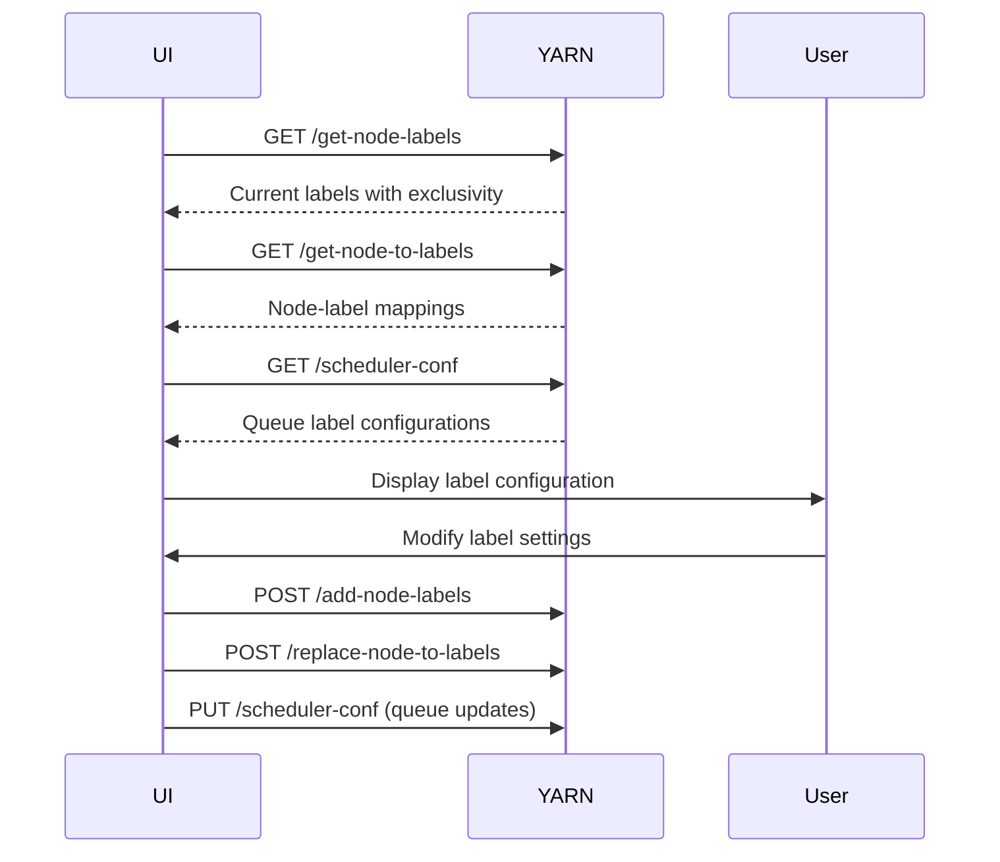

# YARN Capacity Scheduler Node Labels - Comprehensive Documentation

## Table of Contents
1. [Overview](#overview)
2. [Node Label Fundamentals](#node-label-fundamentals)
3. [Configuration Properties](#configuration-properties)
4. [REST API Reference](#rest-api-reference)
5. [Queue Label Configuration](#queue-label-configuration)
6. [Validation Rules and Constraints](#validation-rules-and-constraints)
7. [Command Line Interface](#command-line-interface)
8. [UI Implementation Guide](#ui-implementation-guide)
9. [Common Patterns and Examples](#common-patterns-and-examples)

## Overview

Node labels in YARN provide a mechanism to partition cluster nodes and control where applications run. This feature enables organizations to:
- Dedicate specific nodes for specific workloads
- Ensure applications run on nodes with required hardware/software
- Implement multi-tenancy with physical isolation
- Optimize resource utilization across heterogeneous clusters

## Node Label Fundamentals

### What are Node Labels?

Node labels are tags assigned to cluster nodes that allow the Capacity Scheduler to make placement decisions. They create logical partitions within the cluster.

### Key Characteristics

1. **One Label Per Node**: Each node can have exactly ONE label (or no label)
2. **Default Partition**: Nodes without labels belong to the DEFAULT partition (empty string "")
3. **Label Types**:
   - **Exclusive (default)**: Resources are strictly partitioned
   - **Non-exclusive**: Can share idle resources with DEFAULT partition

### Exclusive vs Non-Exclusive Labels

```yaml
# Exclusive label (default behavior)
- Only containers requesting this specific label can use these nodes
- Provides strict isolation
- Resources remain idle if no matching requests

# Non-exclusive label
- Containers requesting this label get priority
- DEFAULT partition containers can use idle resources
- Better resource utilization
```

### Label Naming Rules

- **Allowed characters**: Alphanumeric (a-z, A-Z, 0-9), hyphen (-), underscore (_)
- **Cannot start with**: Hyphen (-) or underscore (_)
- **Maximum length**: 255 characters
- **Pattern**: `^[0-9a-zA-Z][0-9a-zA-Z-_]*`
- **Reserved**: Cannot use "DEFAULT" as a label name

## Configuration Properties

### Global Node Label Settings

```properties
# Enable node labels feature
yarn.node-labels.enabled=true

# Node labels storage configuration
yarn.node-labels.fs-store.root-dir=hdfs://namenode:port/node-labels

# Configuration type
yarn.node-labels.configuration-type=centralized
# Options: centralized, distributed, delegated-centralized

# Recovery settings
yarn.node-labels.fs-store.retry-policy-spec=2000,500
```

### Queue-Level Label Properties

```properties
# Specify which labels a queue can access
yarn.scheduler.capacity.<queue-path>.accessible-node-labels=label1,label2,label3

# Set capacity for specific label
yarn.scheduler.capacity.<queue-path>.accessible-node-labels.<label>.capacity=30

# Set maximum capacity for specific label
yarn.scheduler.capacity.<queue-path>.accessible-node-labels.<label>.maximum-capacity=100

# Default label for applications in this queue
yarn.scheduler.capacity.<queue-path>.default-node-label-expression=label1

# Disable label inheritance from parent
yarn.scheduler.capacity.<queue-path>.disable-preemption-across-priority-for-labels=label1

# Label-specific user limit factor
yarn.scheduler.capacity.<queue-path>.accessible-node-labels.<label>.user-limit-factor=2.0

# Label-specific minimum user limit
yarn.scheduler.capacity.<queue-path>.accessible-node-labels.<label>.minimum-user-limit-percent=50

# Label-specific maximum AM resource percent
yarn.scheduler.capacity.<queue-path>.accessible-node-labels.<label>.maximum-am-resource-percent=0.5
```

### Special Behaviors

1. **Root Queue**: Always has access to ANY label (represented as "*")
2. **Inheritance**: Child queues inherit parent's accessible labels unless explicitly configured
3. **Empty Label List**: Means queue can only access DEFAULT partition

## REST API Reference

### Label Management APIs

#### 1. Add Node Labels
```http
POST /ws/v1/cluster/add-node-labels
Content-Type: application/json

{
  "nodeLabels": [
    {
      "name": "GPU",
      "exclusivity": true
    },
    {
      "name": "SSD",
      "exclusivity": false
    }
  ]
}
```

**Response**: 200 OK (empty body on success)

#### 2. Remove Node Labels
```http
POST /ws/v1/cluster/remove-node-labels
Content-Type: application/json

{
  "nodeLabels": ["GPU", "SSD"]
}
```

**Response**: 200 OK (empty body on success)

#### 3. Get All Node Labels
```http
GET /ws/v1/cluster/get-node-labels
Accept: application/json
```

**Response**:
```json
{
  "nodeLabelsInfo": {
    "nodeLabels": [
      {
        "name": "GPU",
        "exclusivity": true,
        "partitionInfo": {
          "resourceAvailable": {
            "memory": 16384,
            "vCores": 8
          },
          "resourceTotal": {
            "memory": 32768,
            "vCores": 16
          }
        }
      }
    ]
  }
}
```

### Node-Label Assignment APIs

#### 4. Replace Labels on Nodes
```http
POST /ws/v1/cluster/replace-node-to-labels
Content-Type: application/json

{
  "nodeToLabels": {
    "nodeLabels": [
      {
        "nodeId": "node1.example.com:8041",
        "labels": ["GPU"]
      },
      {
        "nodeId": "node2.example.com:8041",
        "labels": ["SSD"]
      }
    ]
  }
}
```

**Response**: 200 OK (empty body on success)

#### 5. Get Node to Labels Mapping
```http
GET /ws/v1/cluster/get-node-to-labels
Accept: application/json
```

**Response**:
```json
{
  "nodeToLabelsInfo": {
    "nodeToLabels": [
      {
        "nodeId": "node1.example.com:8041",
        "labels": ["GPU"]
      },
      {
        "nodeId": "node2.example.com:8041",
        "labels": ["SSD"]
      }
    ]
  }
}
```

#### 6. Get Labels for Specific Node
```http
GET /ws/v1/cluster/nodes/{nodeId}/get-labels
Accept: application/json
```

**Response**:
```json
{
  "nodeLabelsInfo": {
    "nodeLabels": ["GPU"]
  }
}
```

#### 7. Replace Labels on Specific Node
```http
POST /ws/v1/cluster/nodes/{nodeId}/replace-labels
Content-Type: application/json

{
  "nodeLabels": ["NEW_LABEL"]
}
```

**Response**: 200 OK (empty body on success)

#### 8. Get Label to Nodes Mapping
```http
GET /ws/v1/cluster/label-mappings
Accept: application/json
```

**Response**:
```json
{
  "labelsToNodes": {
    "labelToNodes": [
      {
        "partitionName": "GPU",
        "nodes": [
          "node1.example.com:8041",
          "node3.example.com:8041"
        ]
      }
    ]
  }
}
```

### Error Responses

All APIs return appropriate HTTP status codes:
- **400 Bad Request**: Invalid input (e.g., malformed label name)
- **403 Forbidden**: Insufficient permissions
- **404 Not Found**: Label or node doesn't exist
- **409 Conflict**: Operation conflicts with current state

Example error response:
```json
{
  "RemoteException": {
    "exception": "YarnException",
    "message": "Label name 'invalid-label!' contains invalid characters",
    "javaClassName": "org.apache.hadoop.yarn.exceptions.YarnException"
  }
}
```

## Queue Label Configuration

### Capacity Distribution

Label capacities must follow these rules:

1. **Sibling Queue Rule**: For each label, sibling queues' capacities must sum to 100%
2. **Parent-Child Consistency**: Parent's capacity equals sum of children's absolute capacities
3. **Default Partition**: If not specified, queue gets 0% capacity for a label

Example:
```properties
# Parent queue has access to GPU label
yarn.scheduler.capacity.root.engineering.accessible-node-labels=GPU

# Children must sum to 100% for GPU label
yarn.scheduler.capacity.root.engineering.frontend.accessible-node-labels.GPU.capacity=40
yarn.scheduler.capacity.root.engineering.backend.accessible-node-labels.GPU.capacity=60
```

### Label Access Inheritance

```yaml
root (accessible-node-labels: *)
├── engineering (accessible-node-labels: GPU,SSD)
│   ├── frontend (inherits: GPU,SSD unless overridden)
│   └── backend (accessible-node-labels: GPU - overrides parent)
└── finance (accessible-node-labels: <empty> - only DEFAULT partition)
```

### Default Label Expression

Applications submitted to a queue without specifying a label will use:
1. Queue's `default-node-label-expression` if set
2. DEFAULT partition ("") otherwise

```properties
# Apps in this queue default to GPU nodes
yarn.scheduler.capacity.root.ml.default-node-label-expression=GPU
```

## Validation Rules and Constraints

### Label Validation

```java
// Label naming pattern
Pattern LABEL_PATTERN = Pattern.compile("^[0-9a-zA-Z][0-9a-zA-Z-_]*");

// Validation checks
- Length: 1-255 characters
- Pattern: Must match LABEL_PATTERN
- Reserved: Cannot use "DEFAULT"
- Unique: No duplicate labels in cluster
```

### Capacity Validation

1. **Sum Rule**: Children's capacities for each label must sum to 100%
2. **Range**: Each capacity must be 0-100%
3. **Maximum**: maximum-capacity >= capacity
4. **Zero Capacity**: Queue with 0% capacity for a label cannot use it

### Node Assignment Rules

1. **Single Label**: A node can have at most one label
2. **Label Existence**: Label must exist before assigning to nodes
3. **Node Existence**: Node must be registered with ResourceManager

### Queue Access Rules

1. **Parent Access**: Child can only access labels its parent can access
2. **Root Exception**: Root queue always has access to ANY label
3. **Removal Protection**: Cannot remove label if queues are configured to use it

## Command Line Interface

### Managing Labels

```bash
# Add labels (with exclusivity specification)
yarn rmadmin -addToClusterNodeLabels "GPU(exclusive=true),SSD(exclusive=false)"

# Add labels (default exclusive)
yarn rmadmin -addToClusterNodeLabels "GPU,SSD,MEMORY"

# Remove labels
yarn rmadmin -removeFromClusterNodeLabels "GPU,SSD"

# List all labels
yarn cluster --list-node-labels
```

### Assigning Labels to Nodes

```bash
# Assign labels to nodes
yarn rmadmin -replaceLabelsOnNode "node1.example.com:8041=GPU node2.example.com:8041=SSD"

# Remove all labels from nodes (assign to DEFAULT)
yarn rmadmin -replaceLabelsOnNode "node1.example.com:8041 node2.example.com:8041"

# Check node status (includes label info)
yarn node -status node1.example.com:8041
```

### Direct Node Label Commands

```bash
# Using node-specific endpoints
yarn rmadmin -directlyAccessNodeLabelStore

# Get labels for specific node
yarn node -showDetails node1.example.com:8041
```

## UI Implementation Guide

### Data Flow for Label Management



### Essential UI Components

#### 1. Label Manager
```typescript
interface LabelManagerProps {
  // Display all labels
  labels: NodeLabel[];
  // Add new label
  onAddLabel: (name: string, exclusive: boolean) => Promise<void>;
  // Remove label
  onRemoveLabel: (name: string) => Promise<void>;
  // Toggle exclusivity
  onToggleExclusivity: (name: string) => Promise<void>;
}
```

#### 2. Node Label Assignment
```typescript
interface NodeLabelAssignmentProps {
  // All nodes in cluster
  nodes: ClusterNode[];
  // Available labels
  labels: string[];
  // Current mappings
  nodeToLabels: Map<string, string>;
  // Update node's label
  onAssignLabel: (nodeId: string, label: string | null) => Promise<void>;
}
```

#### 3. Queue Label Configuration
```typescript
interface QueueLabelConfigProps {
  // Queue being configured
  queue: QueueInfo;
  // Available labels
  availableLabels: string[];
  // Current accessible labels
  accessibleLabels: string[];
  // Label capacities
  labelCapacities: Map<string, number>;
  // Update functions
  onUpdateAccessibleLabels: (labels: string[]) => void;
  onUpdateLabelCapacity: (label: string, capacity: number) => void;
  onSetDefaultLabel: (label: string | null) => void;
}
```

### Validation in UI

```typescript
// Validate label name
function validateLabelName(name: string): ValidationResult {
  const pattern = /^[0-9a-zA-Z][0-9a-zA-Z-_]*$/;
  
  if (!name || name.length === 0) {
    return { valid: false, error: "Label name cannot be empty" };
  }
  
  if (name.length > 255) {
    return { valid: false, error: "Label name too long (max 255 chars)" };
  }
  
  if (!pattern.test(name)) {
    return { valid: false, error: "Invalid characters in label name" };
  }
  
  if (name.toUpperCase() === "DEFAULT") {
    return { valid: false, error: "Cannot use 'DEFAULT' as label name" };
  }
  
  return { valid: true };
}

// Validate label capacities
function validateLabelCapacities(
  siblings: QueueInfo[], 
  label: string
): ValidationResult {
  const total = siblings.reduce((sum, queue) => 
    sum + (queue.labelCapacities.get(label) || 0), 0
  );
  
  if (Math.abs(total - 100) > 0.001) {
    return { 
      valid: false, 
      error: `Label '${label}' capacities must sum to 100% (current: ${total}%)`
    };
  }
  
  return { valid: true };
}
```

### State Management Pattern

```typescript
interface NodeLabelStore {
  // State
  labels: Map<string, NodeLabelInfo>;
  nodeAssignments: Map<string, string>;
  queueConfigs: Map<string, QueueLabelConfig>;
  
  // Actions
  loadLabels: () => Promise<void>;
  addLabel: (name: string, exclusive: boolean) => Promise<void>;
  removeLabel: (name: string) => Promise<void>;
  assignNodeLabel: (nodeId: string, label: string | null) => Promise<void>;
  updateQueueLabels: (queuePath: string, labels: string[]) => Promise<void>;
  updateLabelCapacity: (queuePath: string, label: string, capacity: number) => void;
  
  // Computed
  getAccessibleLabels: (queuePath: string) => string[];
  getLabelNodes: (label: string) => string[];
  canRemoveLabel: (label: string) => boolean;
}
```

## Common Patterns and Examples

### Example 1: GPU Node Isolation

```properties
# Create GPU label
yarn rmadmin -addToClusterNodeLabels "GPU"

# Assign to GPU nodes
yarn rmadmin -replaceLabelsOnNode "gpu-node1:8041=GPU gpu-node2:8041=GPU"

# Configure ML queue for GPU access
yarn.scheduler.capacity.root.ml.accessible-node-labels=GPU
yarn.scheduler.capacity.root.ml.accessible-node-labels.GPU.capacity=100
yarn.scheduler.capacity.root.ml.default-node-label-expression=GPU
```

### Example 2: Multi-Tenant Isolation

```properties
# Create tenant labels
yarn rmadmin -addToClusterNodeLabels "TENANT_A,TENANT_B"

# Assign nodes
yarn rmadmin -replaceLabelsOnNode "node1:8041=TENANT_A node2:8041=TENANT_A node3:8041=TENANT_B"

# Configure tenant queues
yarn.scheduler.capacity.root.tenant-a.accessible-node-labels=TENANT_A
yarn.scheduler.capacity.root.tenant-a.accessible-node-labels.TENANT_A.capacity=100
yarn.scheduler.capacity.root.tenant-a.default-node-label-expression=TENANT_A

yarn.scheduler.capacity.root.tenant-b.accessible-node-labels=TENANT_B
yarn.scheduler.capacity.root.tenant-b.accessible-node-labels.TENANT_B.capacity=100
yarn.scheduler.capacity.root.tenant-b.default-node-label-expression=TENANT_B
```

### Example 3: Shared Resources with Non-Exclusive Labels

```properties
# Create non-exclusive label for SSD nodes
yarn rmadmin -addToClusterNodeLabels "SSD(exclusive=false)"

# Assign to SSD nodes
yarn rmadmin -replaceLabelsOnNode "ssd-node1:8041=SSD ssd-node2:8041=SSD"

# Configure data processing queue
yarn.scheduler.capacity.root.data.accessible-node-labels=SSD
yarn.scheduler.capacity.root.data.accessible-node-labels.SSD.capacity=80
# DEFAULT partition jobs can use remaining 20% when idle
```

### Example 4: Hierarchical Label Configuration

```properties
# Root has access to all labels (*)
yarn.scheduler.capacity.root.accessible-node-labels=*

# Production queues use GPU and SSD
yarn.scheduler.capacity.root.production.accessible-node-labels=GPU,SSD
yarn.scheduler.capacity.root.production.accessible-node-labels.GPU.capacity=70
yarn.scheduler.capacity.root.production.accessible-node-labels.SSD.capacity=60

# Production children split the capacity
yarn.scheduler.capacity.root.production.critical.accessible-node-labels.GPU.capacity=80
yarn.scheduler.capacity.root.production.regular.accessible-node-labels.GPU.capacity=20
```

### Common Pitfalls and Solutions

1. **Capacity Sum Violation**
   - Error: "Queue capacities for label X do not sum to 100%"
   - Solution: Ensure all sibling queues' capacities for each label sum to exactly 100%

2. **Label Access Violation**
   - Error: "Queue cannot access label X"
   - Solution: Ensure parent queue has access to the label

3. **Node Assignment to Non-Existent Label**
   - Error: "Label X doesn't exist"
   - Solution: Create label before assigning to nodes

4. **Removing Label in Use**
   - Error: "Label X cannot be removed while configured in queues"
   - Solution: Remove label from all queue configurations first

5. **Invalid Label Name**
   - Error: "Label name contains invalid characters"
   - Solution: Use only alphanumeric, hyphen, underscore; don't start with - or _

### Performance Considerations

1. **Label Count**: No hard limit, but each label adds overhead
2. **Node Assignment Changes**: Triggers scheduler recalculation
3. **Queue Reconfiguration**: May cause temporary scheduling delays
4. **Non-Exclusive Labels**: Better utilization but more complex scheduling

### Best Practices

1. **Plan Label Strategy**: Design label taxonomy before implementation
2. **Use Meaningful Names**: "GPU", "SSD", "HIGHMEM" vs "label1", "label2"
3. **Document Usage**: Maintain documentation of label purposes
4. **Monitor Utilization**: Track resource usage per label
5. **Regular Cleanup**: Remove unused labels and assignments
6. **Test Changes**: Validate in test environment first
7. **Gradual Rollout**: Apply changes incrementally in production