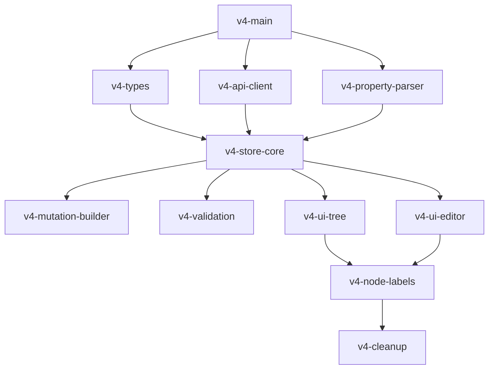

# V4 Task Breakdown

## Progress Summary
- **Completed:** 1/11 tasks (9%)
- **Ready to Start:** 3 parallel tasks (TypeScript types, API client, Property parser)
- **Blocked:** 7 tasks waiting for dependencies

## High Priority Tasks (Can be done in parallel)

### 1. Create v4 folder structure and tracking documents (v4-main) ✅
**Status:** COMPLETED

**Subtasks:**
- [x] Create `src/v4/` directory structure
- [x] Create `src/v4/store/` for Zustand stores
- [x] Create `src/v4/api/` for YARN API client
- [x] Create `src/v4/utils/` for utilities
- [x] Create `src/v4/types/` for TypeScript definitions
- [x] Create `src/v4/components/` for UI components
- [x] Update package.json with Zustand and Immer dependencies

### 2. Create TypeScript types and interfaces (v4-types) 🔷
**Subtasks:**
- [ ] Define QueueNode interface
- [ ] Define SchedulerData interface (from /scheduler)
- [ ] Define ConfigData interface (from /scheduler-conf)
- [ ] Define NodeLabel interfaces
- [ ] Define ResourceInfo interface
- [ ] Define StagedChange interface
- [ ] Define PropertyDescriptor interface
- [ ] Define mutation request/response types
- [ ] Create type guards and validators

### 3. Implement YARN API client (v4-api-client) 🔷
**Subtasks:**
- [ ] Create base API client with auth support
- [ ] Implement GET /scheduler endpoint
- [ ] Implement GET /scheduler-conf endpoint
- [ ] Implement PUT /scheduler-conf endpoint
- [ ] Implement POST /scheduler-conf/validate endpoint
- [ ] Implement GET /scheduler-conf/version endpoint
- [ ] Implement node label endpoints
- [ ] Add error handling and retry logic
- [ ] Add request/response interceptors

### 4. Implement property parsing utilities (v4-property-parser) 🔷
**Subtasks:**
- [ ] Create parseProperty function
- [ ] Create buildPropertyKey function
- [ ] Create queue path utilities
- [ ] Create node label property parsers
- [ ] Add unit tests for all parsers

### 5. Implement core Zustand store (v4-store-core)
**Subtasks:**
- [ ] Create store skeleton with interfaces
- [ ] Implement loadInitialData action
- [ ] Implement refreshSchedulerData action
- [ ] Implement stageQueueChange action
- [ ] Implement stageQueueAddition action
- [ ] Implement stageQueueRemoval action
- [ ] Implement stageLabelQueueChange action
- [ ] Implement applyChanges action
- [ ] Implement computed values/selectors
- [ ] Add middleware for persistence/debugging

## Medium Priority Tasks

### 6. Create mutation request builder (v4-mutation-builder)
**Subtasks:**
- [ ] Create buildMutationRequest function
- [ ] Handle add queue mutations
- [ ] Handle update property mutations
- [ ] Handle remove queue mutations
- [ ] Handle node label mutations
- [ ] Create request validation
- [ ] Add unit tests

### 7. Implement validation (v4-validation)
**Subtasks:**
- [ ] Create validateQueueName function
- [ ] Create property value validators
- [ ] Create capacity validation (sum to 100%)
- [ ] Create node label validation
- [ ] Create change conflict detection
- [ ] Add validation error messages

### 8. Migrate tree visualization (v4-ui-tree)
**Subtasks:**
- [ ] Create QueueTreeV4 component
- [ ] Connect to Zustand store
- [ ] Display live metrics from scheduler data
- [ ] Show configured values from config data
- [ ] Highlight staged changes
- [ ] Add node label view toggle
- [ ] Implement queue selection

### 9. Migrate property editor (v4-ui-editor)
**Subtasks:**
- [ ] Create PropertyEditorV4 component
- [ ] Use metadata-driven form generation
- [ ] Connect to staged changes
- [ ] Add validation feedback
- [ ] Implement node label property editing
- [ ] Add change preview panel

## Low Priority Tasks

### 10. Implement node label management (v4-node-labels)
**Subtasks:**
- [ ] Create node label list component
- [ ] Add node label creation UI
- [ ] Add node label deletion UI
- [ ] Create node assignment UI
- [ ] Implement label-specific capacity view

### 11. Remove old code (v4-cleanup)
**Subtasks:**
- [ ] Remove v2/v3 components
- [ ] Remove old state management
- [ ] Update imports throughout codebase
- [ ] Clean up unused dependencies
- [ ] Update documentation

## Tasks That Can Be Done in Parallel 🔷

The following tasks have no dependencies and can be worked on simultaneously:
1. **v4-types**: TypeScript interfaces
2. **v4-api-client**: YARN API client implementation
3. **v4-property-parser**: Property parsing utilities

These foundational tasks will unblock the core store implementation and subsequent UI work.

## Dependencies

