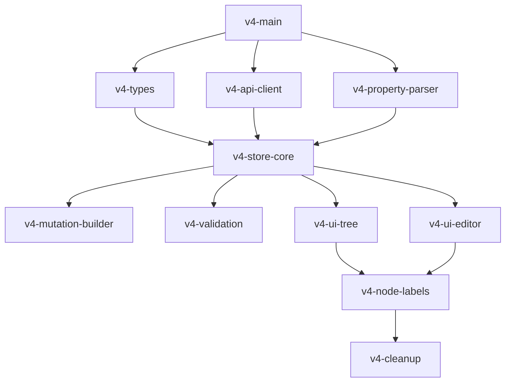

# V4 Task Breakdown

## Progress Summary
- **Completed:** 6/11 tasks (55%)
- **Ready to Start:** 3 UI tasks (Tree visualization, Property editor, Change management)
- **Blocked:** 2 tasks waiting for UI components

## High Priority Tasks (Can be done in parallel)

### 1. Create v4 folder structure and tracking documents (v4-main) ✅
**Status:** COMPLETED

**Subtasks:**
- [x] Create `src/v4/` directory structure
- [x] Create `src/v4/store/` for Zustand stores
- [x] Create `src/v4/api/` for YARN API client
- [x] Create `src/v4/utils/` for utilities
- [x] Create `src/v4/types/` for TypeScript definitions
- [x] Create `src/v4/components/` for UI components
- [x] Update package.json with Zustand and Immer dependencies

### 2. Create TypeScript types and interfaces (v4-types) ✅
**Status:** COMPLETED

**Subtasks:**
- [x] Define QueueNode interface
- [x] Define SchedulerData interface (from /scheduler)
- [x] Define ConfigData interface (from /scheduler-conf)
- [x] Define NodeLabel interfaces
- [x] Define ResourceInfo interface
- [x] Define StagedChange interface
- [x] Define PropertyDescriptor interface
- [x] Define mutation request/response types
- [x] Create type guards and validators

### 3. Implement YARN API client (v4-api-client) ✅
**Status:** COMPLETED

**Subtasks:**
- [x] Create base API client with auth support
- [x] Implement GET /scheduler endpoint
- [x] Implement GET /scheduler-conf endpoint
- [x] Implement PUT /scheduler-conf endpoint
- [x] Implement POST /scheduler-conf/validate endpoint
- [x] Implement GET /scheduler-conf/version endpoint
- [x] Implement node label endpoints
- [x] Add error handling ~~and retry logic~~ (delegated to React Query)
- [x] ~~Add request/response interceptors~~ (simplified - delegated to React Query)

**Additional Completed Work:**
- [x] Created React Query configuration with retry logic
- [x] Created custom hooks for all YARN API endpoints
- [x] Added comprehensive tests for API client and hooks
- [x] Implemented automatic cache invalidation on mutations

### 4. Implement property utilities (v4-property-utils) ✅
**Status:** COMPLETED

**Subtasks:**
- [x] Create buildPropertyKey function for constructing property paths
- [x] Create validateQueueName function (must reject names containing dots)
- [x] Create simple queue path utilities (split, join, getParent, etc.)
- [x] Create node label property key builders
- [x] Handle global property key construction
- [x] Add unit tests for all utilities

**Key Implementation:**
- Property keys are built using template literals: `yarn.scheduler.capacity.${queuePath}.${property}`
- Queue names cannot contain dots (.) - YARN uses dots as path separators with no escaping
- Global properties use the full property name without queue path prefix
- Node label properties: `yarn.scheduler.capacity.${queuePath}.accessible-node-labels.${label}.${property}`

### 5. Implement core Zustand store (v4-store-core) ✅
**Status:** COMPLETED

**Subtasks:**
- [x] Create store skeleton with interfaces (SchedulerStore, QueueNode, StagedChange)
- [x] Implement loadInitialData action (parallel fetch of /scheduler and /scheduler-conf)
- [x] Implement refreshSchedulerData action (refresh only live metrics)
- [x] Implement stageQueueChange action (queue-specific properties)
- [x] Implement stageGlobalChange action (scheduler-wide properties with 'global' queuePath)
- [x] Implement stageQueueAddition action
- [x] Implement stageQueueRemoval action  
- [x] Implement stageLabelQueueChange action (node label properties)
- [x] Implement applyChanges action (build mutation request)
- [x] Implement traverseQueueTree function (combine scheduler structure with config)
- [x] Implement computed values/selectors (getQueueConfiguredCapacity, getQueueDisplayValue)
- [x] Add error handling and input validation

**Additional Completed Features:**
- [x] Added getQueueByPath selector
- [x] Added getChildQueues selector
- [x] Added hasUnsavedChanges selector
- [x] Added getChangesForQueue selector
- [x] Added getStagedChangeById selector
- [x] Refactored to use YarnApiClient instead of direct fetch
- [x] Extracted buildMutationRequest to utils/mutationBuilder.ts
- [x] Added comprehensive error handling with custom error types

**Important Details:**
- **No parsing needed**: Use scheduler data directly for tree structure
- **Global properties**: Use 'global' as queuePath, stored with full property name
- **Dual data sources**: schedulerData (tree + metrics) and configData (properties Map)
- **Staged changes**: Track with queuePath, property, oldValue, newValue

## Medium Priority Tasks

### 6. Create mutation request builder (v4-mutation-builder) ✅
**Status:** COMPLETED (Extracted to utils/mutationBuilder.ts)

**Subtasks:**
- [x] Create buildMutationRequest function
- [x] Handle add queue mutations
- [x] Handle update property mutations (queue properties use property name only)
- [x] Handle remove queue mutations
- [x] Handle global updates (use full property name in 'global-updates' section)
- [x] Handle node label mutations
- [x] Group changes by queue path
- [x] Create request validation (validateMutationRequest)
- [x] Add comprehensive unit tests (32 tests)

**Key Implementation Details:**
- **Global vs Queue**: Global changes go in 'global-updates' with full property names, queue changes use property name only
- **Grouping**: Group all changes for a queue together in the mutation request
- **Queue path**: Use full path like 'root.production.team1' in queue-name field

### 7. Implement validation (v4-validation)
**Subtasks:**
- [ ] Create validateQueueName function
- [ ] Create property value validators
- [ ] Create capacity validation (sum to 100%)
- [ ] Create node label validation
- [ ] Create change conflict detection
- [ ] Add validation error messages

### 8. Migrate tree visualization (v4-ui-tree)
**Status:** IN PROGRESS 🔄
**Estimated Time:** 12 days
**Started:** January 27, 2025
**Approach:** Copy and transform existing React Flow components for direct v4 integration

**Phase 1: Component Migration (2 days) - PARTIALLY COMPLETE**
- [x] Copy visualization components to src/v4/components/tree/
  - [x] QueueVisualization.tsx - Created with tests
  - [x] QueueVisualizationContainer.tsx - Created with tests
  - [ ] QueueCardNode.tsx - Not yet implemented
  - [ ] CustomFlowEdge.tsx - Not yet implemented
- [ ] Copy layout utilities to src/v4/utils/layout/
  - [ ] DagreLayout.ts - Using simple implementation for now
- [x] Update all imports to v4 types (QueueNode instead of ParsedQueue)
- [x] Remove all legacy store imports

**Phase 2: Data Integration (3 days) - IN PROGRESS**
- [x] Create useQueueTreeData hook for v4 store integration
  - [x] Transform QueueNode to React Flow nodes - Working with tests
  - [x] Calculate capacity flows between nodes - Edge creation implemented
  - [x] Apply staged changes visualization - Detects modified/new/deleted
- [ ] Update QueueCardNode component
  - [ ] Read from QueueNode Map properties
  - [ ] Update capacity display logic
  - [ ] Connect to v4 staged changes
- [x] Modify DagreLayout for QueueNode structure
  - [x] Simple tree layout algorithm implemented
  - [x] Positions calculated for all nodes

**Phase 3: Store Integration (2 days)**
- [ ] Wire UI actions to v4 store methods
  - [ ] Queue selection
  - [ ] Add queue → stageQueueAddition
  - [ ] Delete queue → stageQueueRemoval
  - [ ] Property changes → stageQueueChange
- [ ] Replace old hooks with direct v4 store access
- [ ] Create useQueueActions hook for encapsulated actions

**Phase 4: Feature Preservation (3 days)**
- [ ] Reimplement search functionality
  - [ ] Search on QueueNode tree structure
  - [ ] Update search highlighting
- [ ] Update node label filtering
  - [ ] Use v4 nodeLabels and labelConfigs
  - [ ] Update filtering logic
- [ ] Implement comparison mode
  - [ ] Add comparison state to v4 store if needed
  - [ ] Update comparison UI

**Phase 5: Cleanup and Testing (2 days)**
- [ ] Remove ALL legacy dependencies
- [ ] Write tests for tree data transformation
- [ ] Add integration tests with v4 store
- [ ] Ensure zero references to old code

**Key Technical Decisions:**
- **React Flow over D3**: Keeping React Flow for better performance and existing polish
- **Direct Integration**: No adapters, direct transformation from v4 types
- **Component Reuse**: Copy existing components and modify rather than rewrite
- **Type Safety**: Full TypeScript with v4 types throughout

### 9. Migrate property editor (v4-ui-editor)
**Subtasks:**
- [ ] Create PropertyEditorV4 component
- [ ] Use metadata-driven form generation
- [ ] Connect to staged changes
- [ ] Add validation feedback
- [ ] Implement node label property editing
- [ ] Add change preview panel

## Low Priority Tasks

### 10. Implement node label management (v4-node-labels)
**Subtasks:**
- [ ] Create node label list component
- [ ] Add node label creation UI
- [ ] Add node label deletion UI
- [ ] Create node assignment UI
- [ ] Implement label-specific capacity view

### 11. Remove old code (v4-cleanup)
**Subtasks:**
- [ ] Remove v2/v3 components
- [ ] Remove old state management
- [ ] Update imports throughout codebase
- [ ] Clean up unused dependencies
- [ ] Update documentation

## Tasks That Can Be Done in Parallel 🔷

The following tasks have no dependencies and can be worked on simultaneously:
1. **v4-types**: TypeScript interfaces ✅
2. **v4-api-client**: YARN API client implementation ✅
3. **v4-property-utils**: Property utilities (simplified - no parsing needed)

With two of the three parallel tasks completed, the remaining property utilities task is now much simpler since queue paths come pre-parsed from the /scheduler endpoint.

## Dependencies

